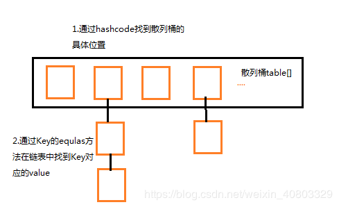

## HashMap

HashMap主要用来存放键值对，它基于哈希表的Map接口实现，是常用的Java集合之一，数据是无序的

jdk1.8在解决哈希冲突时有了较大的变化，当链表长度大于阈值（默认为8）时，将链表转化为红黑树，以减少搜索时间。

JDK1.8 之前 HashMap 由 数组+链表 组成的，数组是 HashMap 的主体，链表则是主要为了解决哈希冲突而存在的.

HashMap的时间复杂度O(1),但是如果冲突较多，链表的时间复杂度是O(n)，所以在JDK1.8 以后，当链表长度大于阈值（默认为 8）时，将链表转化为红黑树，以减少搜索时间，红黑树的时间复杂度是O(log n)。 所以查询一个HashMap数据的时间为 O(1) + O(n)或O(1) + O(log n）平均为O(1)
总结：HashMap根据键的HashCode值存储数据,根据键可以直接获取它的值，具有很快的访问速度，插入、删除和定位元素，HashMap是最好的选择。

## TreeMap

TreeMap是基于红黑树实现的一个保证有序性的Map 基于红黑树，所以TreeMap的时间复杂度是O(log n)，如果需要有排序的数据，直接存放进TreeMap中就行，TreeMap自己会给排序，不需要再写排序代码。

总结：TreeMap取出来的是排序后的键值对。插入、删除需要维护平衡会牺牲一些效率。但如果要按自然顺序或自定义顺序遍历，那么TreeMap会更好。

HashMap通过hashcode对其内容进行快速查找，而 TreeMap中所有的元素都保持着某种固定的顺序，如果你需要得到一个有序的结果你就应该使用TreeMap。HashMap通常比TreeMap效率要高一些，一个是哈希表，一个是二叉树，建议多使用HashMap，在需要排序的Map时候才用TreeMap。HashMap的查询速度比TreeMap要快
