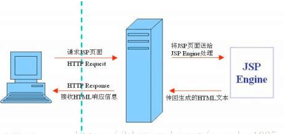

### 1. 什么是JSP

> JSP全称Java Server Pages，是一种动态网页开发技术。它使用JSP标签在HTML网页中插入Java代码。标签通常以<%开头以%>结束。

JSP是一种Java servlet，主要用于实现Java web应用程序的用户界面部分。网页开发者们通过结合HTML代码、XHTML代码、XML元素以及嵌入JSP操作和命令来编写JSP。

JSP通过网页表单获取用户输入数据、访问数据库及其他数据源，然后动态地创建网页。

JSP标签有多种功能，比如访问数据库、记录用户选择信息、访问JavaBeans组件等，还可以在不同的网页中传递控制信息和共享信息。

### 2. 什么是HTML

> HTML（Hyper Text Mark-up Language ）即超文本标记语言，是 WWW 的描述语言。最通俗的说法就是一种超链接，比如收藏一个网页就是保存它的链接。

简单说：

- HTML 是用来描述网页的一种语言。
- HTML 指的是超文本标记语言 (Hyper Text Markup Language)
- HTML 不是一种编程语言，而是一种标记语言 (markup language)
- 标记语言是一套标记标签 (markup tag)
- HTML 使用标记标签来描述网页

### 3. JSP和HTML的区别

- HTML页面是静态页面，也就是事先由用户写好放在服务器上，固定内容，不会变，由web服务器向客户端发送，平时上网看的网页都是大部分都是基于html语言的。

- JSP页面是有JSP容器执行该页面的Java代码部分然后实时生成动态页面，可动态更新页面上的内容。

> 动态网页，是指跟静态网页相对的一种网页编程技术。动态页面的内容一般都是依靠服务器端的程序来生成的，不同人、不同时候访问页面，显示的内容都可能不同。网页设计者在写好服务器端的页面程序后，不需要手工控制，页面内容会按照页面程序的安排自动更改变换。
静态网页，随着html代码的生成，页面的内容和显示效果就基本上不会发生变化了，不管是谁在任何时候看到的页面内容都是一样的，一成不变，除非你修改页面代码。静态html页面文件，可以直接用本地的浏览器打开。

总而言之：

- 定义上HTML页面是静态页面可以直接运行，JSP页面是动态页它运行时需要转换成servlet
- HTML能直接打开，jsp只能发布到Tomact等服务器上才能打开
- html是w3c规范的一种网页书写格式，是一种统一协议语言，静态网页。我们上网看的网页都是大部分都是基于html语言的。jsp是一种基于动态语言，jsp可以实现html的所有任务。
- HTML（Hypertext Markup Language）文本标记语言，它是静态页面，和JavaScript一样解释性语言，只要你有一个浏览器那么它就可以正常显示出来，而不需要指定的编译工具，只需在TXT文档中写上HTML标记就可以正常显示。

- JSP（Java Server Page）是Java服务端的页面，所以它是动态的，它是需要经过JDK编译后把内容发给客户端去显示，我们都知道，Java文件编译后会产生一个class文件，最终执行的就是这个class文件。

html和jsp的表头不一样，这个是JSP的头“ <%@ page language=”java” import=”java.util.*” pageEncoding=”gbk”%>”在表头中有编码格式和倒入包等。也是很好区分的，在jsp中用<%%>就可以写Java代码了，而html没有<%%>。

- 简单说，jsp在后台通过服务器解析为相应的html，然后在供浏览器识别显示。
