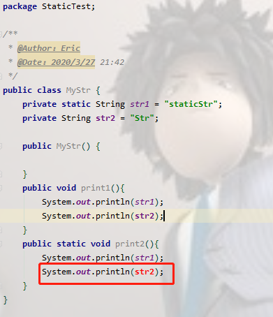
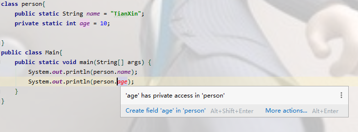

&emsp;static关键字是很多朋友在编写代码和阅读代码时碰到的比较难以理解的一个关键字，我打算写这边博客的起因是在牛客上刷到一道题，特别强调static关键词的重要性，使我意识到我在这方面的基础有着很大的方面欠缺，于是打算查阅资料进行补充。


---

### 一、static关键字的用途
<!--more-->
&emsp;查阅资料，有这样一句话说明了static方法的的特殊之处
>"static方法就是没有this的方法。在static方法内部不能调用非静态方法，反过来是可以的。而且可以在没有创建任何对象的前提下，仅仅通过类本身来调用static方法。这实际上正是static方法的主要用途。"

&emsp;可以看出static关键字的基本作用，简而言之，一句话来描述就是：

>方便在没有创建对象的情况下来进行调用（方法/变量）。

&emsp;被static关键字修饰的方法或者变量不需要依赖于对象来进行访问，只要类被加载了，就可以通过类名去进行访问。

&emsp;static可以用来修饰类的成员方法、类的成员变量，另外可以编写static代码块来优化程序性能。

#### （1）static方法

&emsp;static方法一般称作静态方法，由于静态方法不依赖于任何对象就可以进行访问，因此对于静态方法来说，是没有this的，因为它不依附于任何对象，既然都没有对象，就谈不上this了。并且由于这个特性，在静态方法中不能访问类的非静态成员变量和非静态成员方法，因为非静态成员方法/变量都是必须依赖具体的对象才能够被调用。
&emsp;虽然在静态方法中不能访问非静态成员方法和非静态成员变量，但是在非静态成员方法中是可以访问静态成员方法/变量的。举个简单的例子：

&emsp;在上面的代码中，由于print2方法是独立于对象存在的，可以直接用过类名调用。假如说可以在静态方法中访问非静态方法/变量的话，那么如果在main方法中有下面一条语句：

&emsp;MyStr.print2();

&emsp;此时对象都没有，str2根本就不存在，所以就会产生矛盾了。同样对于方法也是一样，由于你无法预知在print1方法中是否访问了非静态成员变量，所以也禁止在静态成员方法中访问非静态成员方法。

&emsp;而对于非静态成员方法，它访问静态成员方法/变量显然是毫无限制的。

&emsp;因此，如果说想在不创建对象的情况下调用某个方法，就可以将这个方法设置为static。我们最常见的static方法就是main方法，至于为什么main方法必须是static的，现在就很清楚了。因为程序在执行main方法的时候没有创建任何对象，因此只有通过类名来访问。

#### （2）static变量

&emsp;static变量也称作静态变量，静态变量和非静态变量的区别是：静态变量被所有的对象所共享，在内存中只有一个副本，它当且仅当在类初次加载时会被初始化。而非静态变量是对象所拥有的，在创建对象的时候被初始化，存在多个副本，各个对象拥有的副本互不影响。

&emsp;static成员变量的初始化顺序按照定义的顺序进行初始化

#### （3）static代码块

```java
public class Person {
    private Date birthDate;

    public Person(Date birthDate) {
        this.birthDate = birthDate;
    }

    boolean isBornBoomer() {
        Date startDate = Date.valueOf("1997");
        Date endDate = Date.valueOf("1999");
        return birthDate.compareTo(startDate)>=0 && birthDate.compareTo(endDate) < 0;
    }
}
```

isBornBoomer是用来这个人是否是1997-1999年出生的，而每次isBornBoomer被调用的时候，都会生成startDate和birthDate两个对象，造成了空间浪费，如果改成这样效率会更好：

```java
class Person{
    private Date birthDate;
    private static Date startDate,endDate;
    static{
        startDate = Date.valueOf("1997");
        endDate = Date.valueOf("1999");
    }

    public Person(Date birthDate) {
        this.birthDate = birthDate;
    }

    boolean isBornBoomer() {
        return birthDate.compareTo(startDate)>=0 && birthDate.compareTo(endDate) < 0;
    }
}
```

　因此，很多时候会将一些只需要进行一次的初始化操作都放在static代码块中进行。

---

### 二、static关键字的误区

#### 1.static关键字会改变类中成员的访问权限吗

比较容易java中的static与C/C++中的static关键字的功能混淆。在这里只需要记住一点：与C/C++中的static不同，Java中的static关键字不会影响到变量或者方法的作用域。在Java中能够影响到访问权限的只有private、public、protected（包括包访问权限）这几个关键字。看下面的例子就明白了：


提示'age' has private access in 'person'，这说明static关键字并不会改变变量和方法的访问权限。

#### 2.能通过this访问静态成员变量吗

虽然对于静态方法来说没有this，那么在非静态方法中能够通过this访问静态成员变量吗？先看下面的一个例子，这段代码输出的结果是什么？

```java
public class Main {
    static int value = 33;

    public static void main(String[] args) throws Exception{
        new Main().printValue();
    }

    private void printValue(){
        int value = 3;
        System.out.println(this.value);
    }
}
```

输出结果：

```java
33
```

这里面主要考察队this和static的理解。this代表什么？this代表当前对象，那么通过new Main()来调用printValue的话，当前对象就是通过new Main()生成的对象。而static变量是被对象所享有的，因此在printValue中的this.value的值毫无疑问是33。在printValue方法内部的value是局部变量，根本不可能与this关联，所以输出结果是33。在这里永远要记住一点：静态成员变量虽然独立于对象，但是不代表不可以通过对象去访问，所有的静态方法和静态变量都可以通过对象访问（只要访问权限足够）

#### 3.static能作用于局部变量么

　　在C/C++中static是可以作用域局部变量的，但是在Java中切记：static是不允许用来修饰局部变量。不要问为什么，这是Java语法的规定。
局部变量最好不要设成静态变量，局变变量是有生命周期的，用完后JAVA很快就回收资源了。如果设成静态变量，那JAVA怎么回收被其占用的内存。

---

### 三、常见的笔试面试题

```java
public class Test extends Base{

    static{
        System.out.println("test static");
    }

    public Test(){
        System.out.println("test constructor");
    }

    public static void main(String[] args) {
        new Test();
    }
}

class Base{

    static{
        System.out.println("base static");
    }

    public Base(){
        System.out.println("base constructor");
    }
}
```

运行结果：

```java
base static
test static
base constructor
test constructor
```

代码具体的执行过程，在执行开始，先要寻找到main方法，因为main方法是程序的入口，但是在执行main方法之前，必须先加载Test类，而在加载Test类的时候发现Test类继承自Base类，因此会转去先加载Base类，在加载Base类的时候，发现有static块，便执行了static块。在Base类加载完成之后，便继续加载Test类，然后发现Test类中也有static块，便执行static块。在加载完所需的类之后，便开始执行main方法。在main方法中执行new Test()的时候会先调用父类的构造器，然后再调用自身的构造器。因此，便出现了上面的输出结果。

---

2.这段代码的输出结果是什么？

```java
public class Test {
    Person person = new Person("Test");
    static{
        System.out.println("test static");
    }
    public Test() {
        System.out.println("test constructor");
    }
    public static void main(String[] args) {
        new MyClass();
    }
}

class Person{
    static{
        System.out.println("person static");
    }
    public Person(String str) {
        System.out.println("person "+str);
    }
}

class MyClass extends Test {
    Person person = new Person("MyClass");
    static{
        System.out.println("myclass static");
    }
    public MyClass() {
        System.out.println("myclass constructor");
    }
}
```

运行结果:

```java
test static
myclass static
person static
person Test
test constructor
person MyClass
myclass constructor
```

首先加载Test类，因此会执行Test类中的static块。接着执行new MyClass()，而MyClass类还没有被加载，因此需要加载MyClass类。在加载MyClass类的时候，发现MyClass类继承自Test类，但是由于Test类已经被加载了，所以只需要加载MyClass类，那么就会执行MyClass类的中的static块。在加载完之后，就通过构造器来生成对象。而在生成对象的时候，必须先初始化父类的成员变量，因此会执行Test中的Person person = new Person()，而Person类还没有被加载过，因此会先加载Person类并执行Person类中的static块，接着执行父类的构造器，完成了父类的初始化，然后就来初始化自身了，因此会接着执行MyClass中的Person person = new Person()，最后执行MyClass的构造器。

---

3.这段代码的输出结果是什么？

```java
public class Test {

    static{
        System.out.println("test static 1");
    }
    public static void main(String[] args) {

    }

    static{
        System.out.println("test static 2");
    }
}
```

运行结果：

```java
test static 1
test static 2
```

虽然在main方法中没有任何语句，但是还是会输出，原因上面已经讲述过了。另外，static块可以出现类中的任何地方（只要不是方法内部，记住，任何方法内部都不行），并且执行是按照static块的顺序执行的。
