## 1.Java 内存区域与内存溢出异常

### 1.1 运行时数据区域

> 根据《Java 虚拟机规范(Java SE 7 版)》规定，Java 虚拟机所管理的内存如下图所示。


#### 1.1.1 程序计数器

> 内存空间小，线程私有。字节码解释器工作是就是通过改变这个计数器的值来选取下一条需要执行指令的字节码指令，分支、循环、跳转、异常处理、线程恢复等基础功能都需要依赖计数器完成

如果线程正在执行一个 Java 方法，这个计数器记录的是正在执行的虚拟机字节码指令的地址；如果正在执行的是 Native 方法，这个计数器的值则为 (Undefined)。此内存区域是唯一一个在 Java 虚拟机规范中没有规定任何 OutOfMemoryError 情况的区域。

#### 1.1.2 Java 虚拟机栈

> 线程私有，生命周期和线程一致。描述的是 Java 方法执行的内存模型：每个方法在执行时都会床创建一个栈帧(Stack Frame)用于存储局部变量表、操作数栈、动态链接、方法出口等信息。每一个方法从调用直至执行结束，就对应着一个栈帧从虚拟机栈中入栈到出栈的过程。

局部变量表：存放了编译期可知的各种基本类型(boolean、byte、char、short、int、float、long、double)、对象引用(reference 类型)和 returnAddress 类型(指向了一条字节码指令的地址)

StackOverflowError：线程请求的栈深度大于虚拟机所允许的深度。
OutOfMemoryError：如果虚拟机栈可以动态扩展，而扩展时无法申请到足够的内存。

#### 1.1.3 本地方法栈

> 区别于 Java 虚拟机栈的是，Java 虚拟机栈为虚拟机执行 Java 方法(也就是字节码)服务，而本地方法栈则为虚拟机使用到的 Native 方法服务。也会有 StackOverflowError 和 OutOfMemoryError 异常。

#### 1.1.4 Java 堆

> 对于绝大多数应用来说，这块区域是 JVM 所管理的内存中最大的一块。线程共享，主要是存放对象实例和数组。内部会划分出多个线程私有的分配缓冲区(Thread Local Allocation Buffer, TLAB)。可以位于物理上不连续的空间，但是逻辑上要连续。

OutOfMemoryError：如果堆中没有内存完成实例分配，并且堆也无法再扩展时，抛出该异常。

#### 1.1.5 方法区

> 属于共享内存区域，存储已被虚拟机加载的类信息、常量、静态变量、即时编译器编译后的代码等数据。

#### 1.1.6 运行时常量池

> 属于方法区一部分，用于存放编译期生成的各种字面量和符号引用。编译器和运行期(String 的 intern() )都可以将常量放入池中。内存有限，无法申请时抛出 OutOfMemoryError。

#### 1.1.7 直接内存

> 非虚拟机运行时数据区的部分

在 JDK 1.4 中新加入 NIO (New Input/Output) 类，引入了一种基于通道(Channel)和缓存(Buffer)的 I/O 方式，它可以使用 Native 函数库直接分配堆外内存，然后通过一个存储在 Java 堆中的 DirectByteBuffer 对象作为这块内存的引用进行操作。可以避免在 Java 堆和 Native 堆中来回的数据耗时操作。
OutOfMemoryError：会受到本机内存限制，如果内存区域总和大于物理内存限制从而导致动态扩展时出现该异常。

### 1.2 HotSpot 虚拟机对象探秘

> 主要介绍数据是如何创建、如何布局以及如何访问的。

#### 1.2.1 对象的创建

遇到 new 指令时，首先检查这个指令的参数是否能在常量池中定位到一个类的符号引用，并且检查这个符号引用代表的类是否已经被加载、解析和初始化过。如果没有，执行相应的类加载。

类加载检查通过之后，为新对象分配内存(内存大小在类加载完成后便可确认)。在堆的空闲内存中划分一块区域(‘指针碰撞-内存规整’或‘空闲列表-内存交错’的分配方式)。

前面讲的每个线程在堆中都会有私有的分配缓冲区(TLAB)，这样可以很大程度避免在并发情况下频繁创建对象造成的线程不安全。

内存空间分配完成后会初始化为 0(不包括对象头)，接下来就是填充对象头，把对象是哪个类的实例、如何才能找到类的元数据信息、对象的哈希码、对象的 GC 分代年龄等信息存入对象头。

执行 new 指令后执行 init 方法后才算一份真正可用的对象创建完成。

#### 1.2.2 对象的内存布局

> 在 HotSpot 虚拟机中，分为 3 块区域：对象头(Header)、实例数据(Instance Data)和对齐填充(Padding)

对象头(Header)：包含两部分，第一部分用于存储对象自身的运行时数据，如哈希码、GC 分代年龄、锁状态标志、线程持有的锁、偏向线程 ID、偏向时间戳等，32 位虚拟机占 32 bit，64 位虚拟机占 64 bit。官方称为 ‘Mark Word’。第二部分是类型指针，即对象指向它的类的元数据指针，虚拟机通过这个指针确定这个对象是哪个类的实例。另外，如果是 Java 数组，对象头中还必须有一块用于记录数组长度的数据，因为普通对象可以通过 Java 对象元数据确定大小，而数组对象不可以。

实例数据(Instance Data)：程序代码中所定义的各种类型的字段内容(包含父类继承下来的和子类中定义的)。

对齐填充(Padding)：不是必然需要，主要是占位，保证对象大小是某个字节的整数倍。

#### 1.2.3 对象的访问定位

> 使用对象时，通过栈上的 reference 数据来操作堆上的具体对象。

通过句柄访问

> Java 堆中会分配一块内存作为句柄池。reference 存储的是句柄地址。详情见图。


使用直接指针访问

> reference 中直接存储对象地址

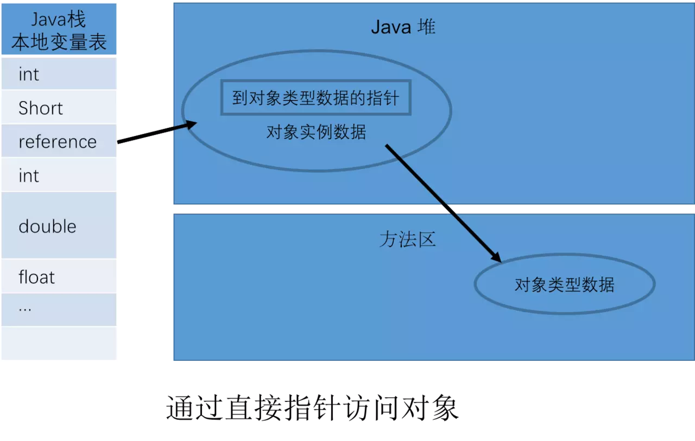

比较：使用句柄的最大好处是 reference 中存储的是稳定的句柄地址，在对象移动(GC)是只改变实例数据指针地址，reference 自身不需要修改。直接指针访问的最大好处是速度快，节省了一次指针定位的时间开销。如果是对象频繁 GC 那么句柄方法好，如果是对象频繁访问则直接指针访问好。

## 2. 垃圾回收器与内存分配策略

### 2.1 概述

> 程序计数器、虚拟机栈、本地方法栈 3 个区域随线程生灭(因为是线程私有)，栈中的栈帧随着方法的进入和退出而有条不紊地执行着出栈和入栈操作。而 Java 堆和方法区则不一样，一个接口中的多个实现类需要的内存可能不一样，一个方法中的多个分支需要的内存也可能不一样，我们只有在程序处于运行期才知道那些对象会创建，这部分内存的分配和回收都是动态的，垃圾回收期所关注的就是这部分内存。

### 2.2 对象已死吗

> 在进行内存回收之前要做的事情就是判断那些对象是‘死’的，哪些是‘活’的。

#### 2.2.1 引用计数法

> 给对象添加一个引用计数器。但是难以解决循环引用问题。

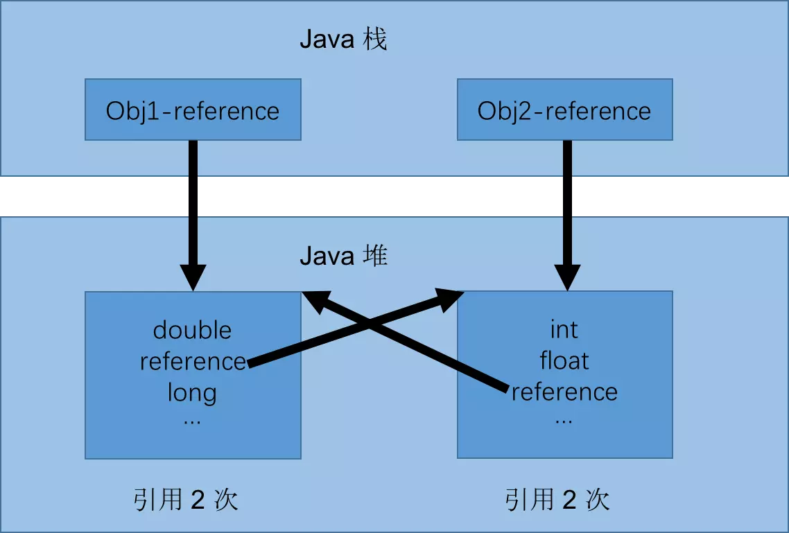

从图中可以看出，如果不下小心直接把 Obj1-reference 和 Obj2-reference 置 null。则在 Java 堆当中的两块内存依然保持着互相引用无法回收。

#### 2.2.2 可达性分析法

> 通过一系列的 ‘GC Roots’ 的对象作为起始点，从这些节点出发所走过的路径称为引用链。当一个对象到 GC Roots 没有任何引用链相连的时候说明对象不可用。


可作为 GC Roots 的对象：

- 虚拟机栈(栈帧中的本地变量表)中引用的对象
- 方法区中类静态属性引用的对象
- 方法区中常量引用的对象
- 本地方法栈中 JNI(即一般说的 Native 方法) 引用的对象

#### 2.2.3 引用

> 前面的两种方式判断存活时都与‘引用’有关。但是 JDK 1.2 之后，引用概念进行了扩充

种引用强度一次逐渐减弱

强引用

> 类似于 Object obj = new Object(); 创建的，只要强引用在就不回收。

软引用

> SoftReference 类实现软引用。在系统要发生内存溢出异常之前，将会把这些对象列进回收范围之中进行二次回收。

弱引用

> WeakReference 类实现弱引用。对象只能生存到下一次垃圾收集之前。在垃圾收集器工作时，无论内存是否足够都会回收掉只被弱引用关联的对象。

虚引用

> PhantomReference 类实现虚引用。无法通过虚引用获取一个对象的实例，为一个对象设置虚引用关联的唯一目的就是能在这个对象被收集器回收时收到一个系统通知。

#### 2.2.4 生存还是死亡

即使在可达性分析算法中不可达的对象，也并非是“facebook”的，这时候它们暂时出于“缓刑”阶段，一个对象的真正死亡至少要经历两次标记过程：如果对象在进行中可达性分析后发现没有与 GC Roots 相连接的引用链，那他将会被第一次标记并且进行一次筛选，筛选条件是此对象是否有必要执行 finalize() 方法。当对象没有覆盖 finalize() 方法，或者 finalize() 方法已经被虚拟机调用过，虚拟机将这两种情况都视为“没有必要执行”。

如果这个对象被判定为有必要执行 finalize() 方法，那么这个对象竟会放置在一个叫做 F-Queue 的队列中，并在稍后由一个由虚拟机自动建立的、低优先级的 Finalizer 线程去执行它。这里所谓的“执行”是指虚拟机会出发这个方法，并不承诺或等待他运行结束。finalize() 方法是对象逃脱死亡命运的最后一次机会，稍后 GC 将对 F-Queue 中的对象进行第二次小规模的标记，如果对象要在 finalize() 中成功拯救自己 —— 只要重新与引用链上的任何一个对象简历关联即可。

finalize() 方法只会被系统自动调用一次。

#### 2.2.5 回收方法区

> 在堆中，尤其是在新生代中，一次垃圾回收一般可以回收 70% ~ 95% 的空间，而永久代的垃圾收集效率远低于此。
永久代垃圾回收主要两部分内容：废弃的常量和无用的类。

判断废弃常量：一般是判断没有该常量的引用。

判断无用的类：要以下三个条件都满足

- 该类所有的实例都已经回收，也就是 Java 堆中不存在该类的任何实例
- 加载该类的 ClassLoader 已经被回收
- 该类对应的 java.lang.Class 对象没有任何地方呗引用，无法在任何地方通过反射访问该类的方法

### 2.3 垃圾回收算法

#### 2.3.1 标记 —— 清除算法

> 直接标记清除就可。

两个不足：

- 效率不高
- 空间会产生大量碎片

#### 2.3.2 复制算法

> 把空间分成两块，每次只对其中一块进行 GC。当这块内存使用完时，就将还存活的对象复制到另一块上面。

解决前一种方法的不足，但是会造成空间利用率低下。因为大多数新生代对象都不会熬过第一次 GC。所以没必要 1 : 1 划分空间。可以分一块较大的 Eden 空间和两块较小的 Survivor 空间，每次使用 Eden 空间和其中一块 Survivor。当回收时，将 Eden 和 Survivor 中还存活的对象一次性复制到另一块 Survivor 上，最后清理 Eden 和 Survivor 空间。大小比例一般是 8 : 1 : 1，每次浪费 10% 的 Survivor 空间。但是这里有一个问题就是如果存活的大于 10% 怎么办？这里采用一种分配担保策略：多出来的对象直接进入老年代。

#### 2.3.3 标记-整理算法

> 不同于针对新生代的复制算法，针对老年代的特点，创建该算法。主要是把存活对象移到内存的一端。

#### 2.3.4 分代回收

> 根据存活对象划分几块内存区，一般是分为新生代和老年代。然后根据各个年代的特点制定相应的回收算法。

- 新生代

> 每次垃圾回收都有大量对象死去，只有少量存活，选用复制算法比较合理。

- 老年代

> 老年代中对象存活率较高、没有额外的空间分配对它进行担保。所以必须使用 标记 —— 清除 或者 标记 —— 整理 算法回收。

### 2.4 HotSpot 的算法实现

[HotSpot的算法实现](http://www.theoak.online/2019/10/15/HotSpot%E7%9A%84%E7%AE%97%E6%B3%95%E5%AE%9E%E7%8E%B0/)

### 2.5 垃圾回收器

> 收集算法是内存回收的理论，而垃圾回收器是内存回收的实践。

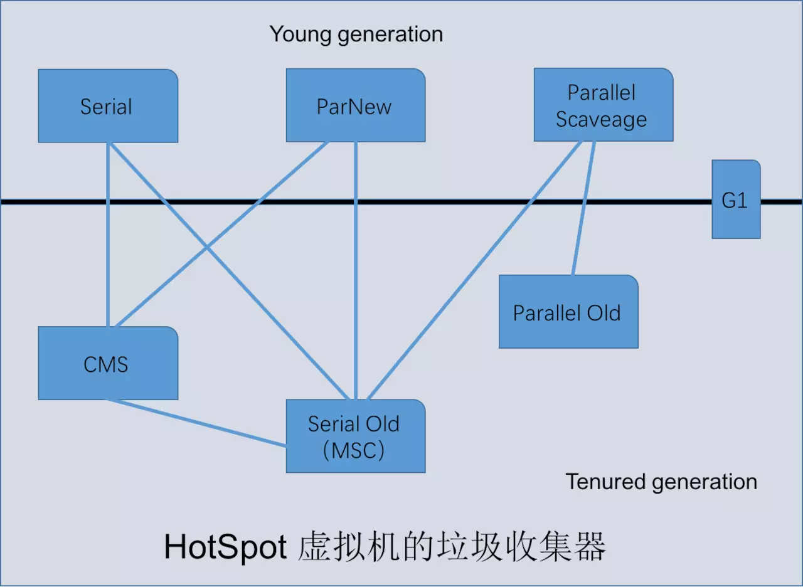

**说明：** 如果两个收集器之间存在连线说明他们之间可以搭配使用。

#### 2.5.1 Serial 收集器

> 这是一个单线程收集器。意味着它只会使用一个 CPU 或一条收集线程去完成收集工作，并且在进行垃圾回收时必须暂停其它所有的工作线程直到收集结束。


#### 2.5.2 ParNew 收集器

> 可以认为是 Serial 收集器的多线程版本。

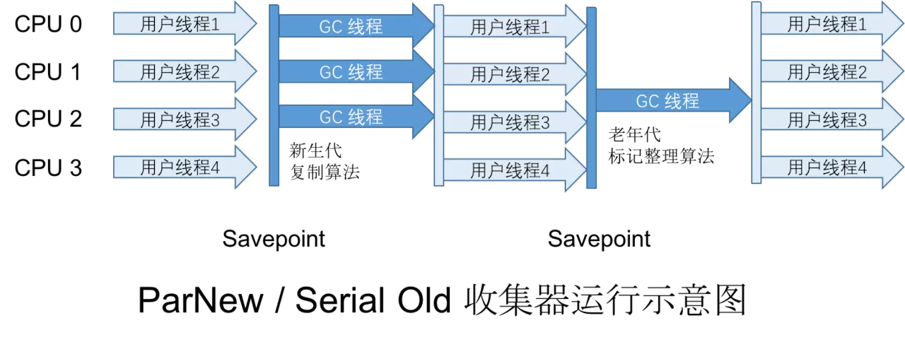

并行：Parallel

> 指多条垃圾收集线程并行工作，此时用户线程处于等待状态

并发：Concurrent

> 指用户线程和垃圾回收线程同时执行(不一定是并行，有可能是交叉执行)，用户进程在运行，而垃圾回收线程在另一个 CPU 上运行。

#### 2.5.3 Parallel Scavenge 收集器

> 这是一个新生代收集器，也是使用复制算法实现，同时也是并行的多线程收集器。

CMS 等收集器的关注点是尽可能地缩短垃圾收集时用户线程所停顿的时间，而 Parallel Scavenge 收集器的目的是达到一个可控制的吞吐量(Throughput = 运行用户代码时间 / (运行用户代码时间 + 垃圾收集时间))。

作为一个吞吐量优先的收集器，虚拟机会根据当前系统的运行情况收集性能监控信息，动态调整停顿时间。这就是 GC 的自适应调整策略(GC Ergonomics)。

#### 2.5.4 Serial Old 收集器

> 收集器的老年代版本，单线程，使用 标记 —— 整理。


#### 2.5.5 Parallel Old 收集器

> Parallel Old 是 Parallel Scavenge 收集器的老年代版本。多线程，使用 标记 —— 整理

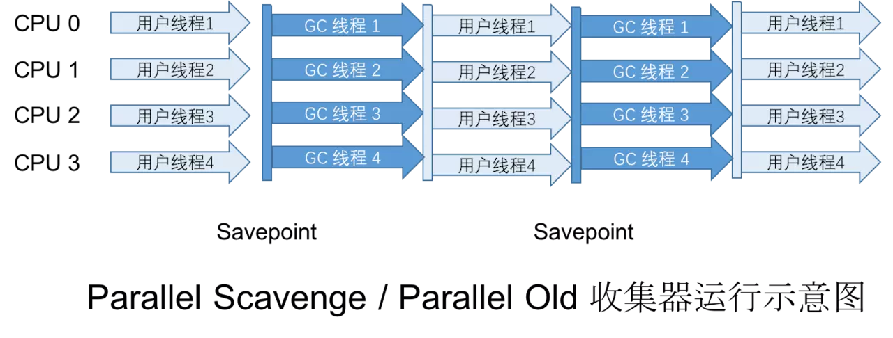

#### 2.5.6 CMS 收集器

> CMS (Concurrent Mark Sweep) 收集器是一种以获取最短回收停顿时间为目标的收集器。基于 标记 —— 清除 算法实现。

运作步骤:

- 初始标记(CMS initial mark)：标记 GC Roots 能直接关联到的对象
- 并发标记(CMS concurrent mark)：进行 GC Roots Tracing
- 重新标记(CMS remark)：修正并发标记期间的变动部分
- 并发清除(CMS concurrent sweep)

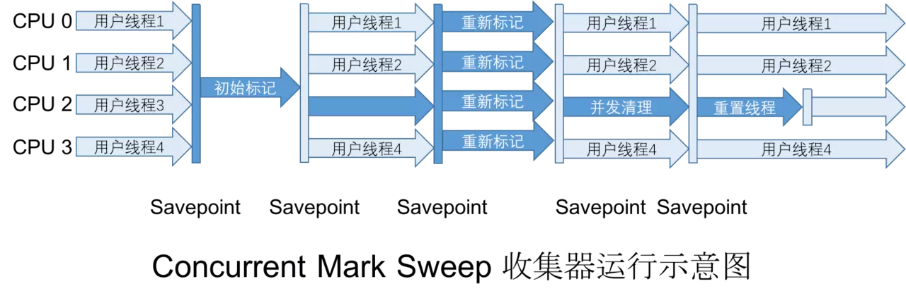

缺点：对 CPU 资源敏感、无法收集浮动垃圾、标记 —— 清除 算法带来的空间碎片

#### 2.5.7 G1 收集器

> 面向服务端的垃圾回收器。

优点：并行与并发、分代收集、空间整合、可预测停顿。

运作步骤:

- 初始标记(Initial Marking)
- 并发标记(Concurrent Marking)
- 最终标记(Final Marking)
- 筛选回收(Live Data Counting and Evacuation)

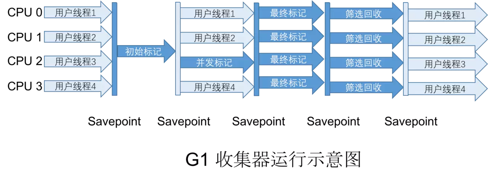

### 2.6 内存分配与回收策略

#### 2.6.1 对象优先在 Eden 分配

> 对象主要分配在新生代的 Eden 区上，如果启动了本地线程分配缓冲区，将线程优先在 (TLAB) 上分配。少数情况会直接分配在老年代中。

一般来说 Java 堆的内存模型如下图所示：


新生代 GC (Minor GC)

> 发生在新生代的垃圾回收动作，频繁，速度快。

老年代 GC (Major GC / Full GC)

> 发生在老年代的垃圾回收动作，出现了 Major GC 经常会伴随至少一次 Minor GC(非绝对)。Major GC 的速度一般会比 Minor GC 慢十倍以上。

#### 2.6.2 大对象直接进入老年代

#### 2.6.3 长期存活的对象将进入老年代

#### 2.6.4 动态对象年龄判定

#### 2.6.5 空间分配担保

## 3. Java 内存模型与线程

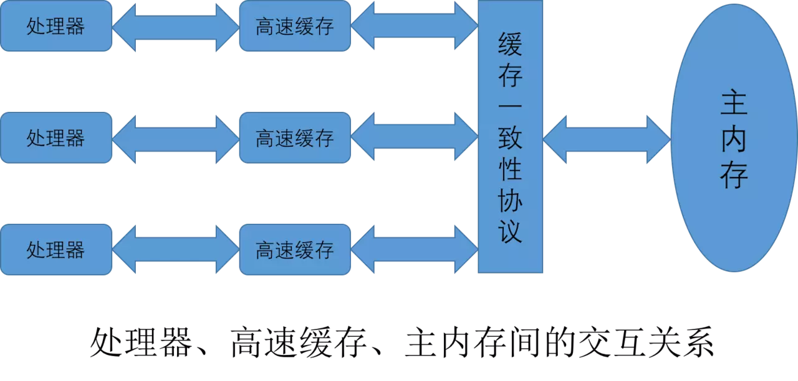

### 3.1 Java 内存模型

#### 3.1.1 主内存和工作内存之间的交互

操作|作用对象|解释
:-:|:-:|:-:
lock|主内存|把一个变量标识为一条线程独占的状态
unlock|主内存|把一个处于锁定状态的变量释放出来，释放后才可被其他线程锁定
read|主内存|把一个变量的值从主内存传输到线程工作内存中，以便 load 操作使用
load|工作内存|把 read 操作从主内存中得到的变量值放入工作内存中
use|工作内存|把工作内存中一个变量的值传递给执行引擎，每当虚拟机遇到一个需要使用到变量值的字节码指令时将会执行这个操作
assign|工作内存|把一个从执行引擎接收到的值赋接收到的值赋给工作内存的变量，每当虚拟机遇到一个给变量赋值的字节码指令时执行这个操作
store|工作内存|把工作内存中的一个变量的值传送到主内存中，以便 write 操作
write|工作内存|把 store 操作从工作内存中得到的变量的值放入主内存的变量中

#### 3.1.2 对于 volatile 型变量的特殊规则

> 关键字 volatile 是 Java 虚拟机提供的最轻量级的同步机制。

一个变量被定义为 volatile 的特性：

保证此变量对所有线程的可见性。但是操作并非原子操作，并发情况下不安全。

> 果不符合 运算结果并不依赖变量当前值，或者能够确保只有单一的线程修改变量的值 和 变量不需要与其他的状态变量共同参与不变约束 就要通过加锁(使用 synchronize 或 java.util.concurrent 中的原子类)来保证原子性。

禁止指令重排序优化。

> 通过插入内存屏障保证一致性。

#### 3.1.3 对于 long 和 double 型变量的特殊规则

> Java 要求对于主内存和工作内存之间的八个操作都是原子性的，但是对于 64 位的数据类型，有一条宽松的规定：允许虚拟机将没有被 volatile 修饰的 64 位数据的读写操作划分为两次 32 位的操作来进行，即允许虚拟机实现选择可以不保证 64 位数据类型的 load、store、read 和 write 这 4 个操作的原子性。这就是 long 和 double 的非原子性协定。

#### 3.1.4 原子性、可见性与有序性

- 原子性(Atomicity)

> 由 Java 内存模型来直接保证的原子性变量操作包括 read、load、assign、use、store 和 write。大致可以认为基本数据类型的操作是原子性的。同时 lock 和 unlock 可以保证更大范围操作的原子性。而 synchronize 同步块操作的原子性是用更高层次的字节码指令 monitorenter 和 monitorexit 来隐式操作的。

- 可见性(Visibility)

> 是指当一个线程修改了共享变量的值，其他线程也能够立即得知这个通知。主要操作细节就是修改值后将值同步至主内存(volatile 值使用前都会从主内存刷新)，除了 volatile 还有 synchronize 和 final 可以保证可见性。同步块的可见性是由“对一个变量执行 unlock 操作之前，必须先把此变量同步会主内存中( store、write 操作)”这条规则获得。而 final 可见性是指：被 final 修饰的字段在构造器中一旦完成，并且构造器没有把 “this” 的引用传递出去( this 引用逃逸是一件很危险的事情，其他线程有可能通过这个引用访问到“初始化了一半”的对象)，那在其他线程中就能看见 final 字段的值。

- 有序性(Ordering)

> 如果在被线程内观察，所有操作都是有序的；如果在一个线程中观察另一个线程，所有操作都是无序的。前半句指“线程内表现为串行的语义”，后半句是指“指令重排”现象和“工作内存与主内存同步延迟”现象。Java 语言通过 volatile 和 synchronize 两个关键字来保证线程之间操作的有序性。volatile 自身就禁止指令重排，而 synchronize 则是由“一个变量在同一时刻指允许一条线程对其进行 lock 操作”这条规则获得，这条规则决定了持有同一个锁的两个同步块只能串行的进入。

#### 3.1.5 先行发生原则

> 也就是 happens-before 原则。这个原则是判断数据是否存在竞争、线程是否安全的主要依据。先行发生是 Java 内存模型中定义的两项操作之间的偏序关系。

天然的先行发生关系

规则|解释
:-:|:-:
程序次序规则|在一个线程内，代码按照书写的控制流顺序执行
管程锁定规则|一个 unlock 操作先行发生于后面对同一个锁的 lock 操作
volatile 变量规则|volatile 变量的写操作先行发生于后面对这个变量的读操作
线程启动规则|Thread 对象的 start() 方法先行发生于此线程的每一个动作线程终止规则|线程中所有的操作都先行发生于对此线程的终止检测(通过 Thread.join() 方法结束、 Thread.isAlive() 的返回值检测)
线程中断规则|对线程 interrupt() 方法调用优先发生于被中断线程的代码检测到中断事件的发生(通过 Thread.interrupted() 方法检测)
对象终结规则|一个对象的初始化完成(构造函数执行结束)先行发生于它的 finalize() 方法的开始
传递性|如果操作 A 先于 操作 B 发生，操作 B 先于 操作 C 发生，那么操作 A 先于 操作 C

### 3.2 Java 与线程

#### 3.2.1 线程的实现

使用内核线程实现

> 直接由操作系统内核支持的线程，这种线程由内核完成切换。程序一般不会直接去使用内核线程，而是去使用内核线程的一种高级接口 —— 轻量级进程(LWP)，轻量级进程就是我们通常意义上所讲的线程，每个轻量级进程都有一个内核级线程支持。

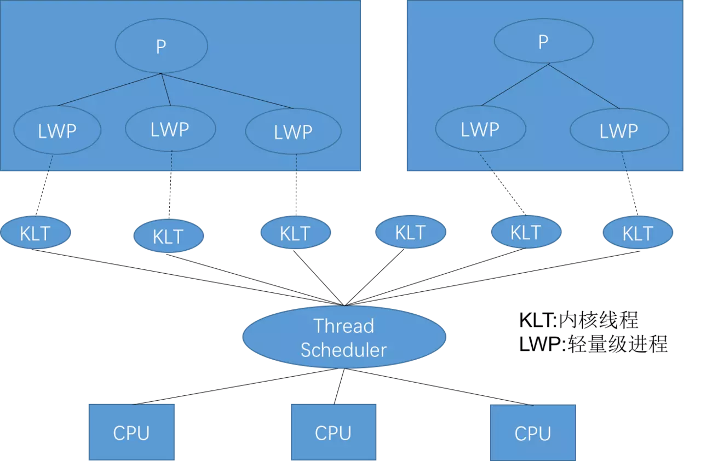

使用用户线程实现

> 广义上来说，只要不是内核线程就可以认为是用户线程，因此可以认为轻量级进程也属于用户线程。狭义上说是完全建立在用户空间的线程库上的并且内核系统不可感知的。


使用用户线程夹加轻量级进程混合实现

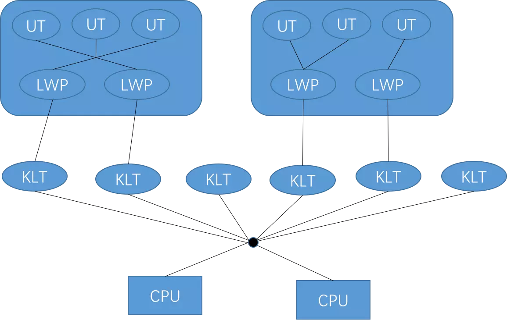

Java 线程实现

> 平台不同实现方式不同，可以认为是一条 Java 线程映射到一条轻量级进程。

#### 3.2.2 Java 线程调度

协同式线程调度

> 线程执行时间由线程自身控制，实现简单，切换线程自己可知，所以基本没有线程同步问题。坏处是执行时间不可控，容易阻塞。

抢占式线程调度

> 每个线程由系统来分配执行时间。

#### 3.2.3 状态转换

五种状态：

- 新建(new)

> 创建后尚未启动的线程。

- 运行(Runable)

> Runable 包括了操作系统线程状态中的 Running 和 Ready，也就是出于此状态的线程有可能正在执行，也有可能正在等待 CPU 为他分配时间。

- 无限期等待(Waiting)

> 出于这种状态的线程不会被 CPU 分配时间，它们要等其他线程显示的唤醒。

以下方法会然线程进入无限期等待状态：
没有设置 Timeout 参数的 Object.wait() 方法。
没有设置 Timeout 参数的 Thread.join() 方法。
LookSupport.park() 方法。

- 限期等待(Timed Waiting)
  
> 处于这种状态的线程也不会分配时间，不过无需等待配其他线程显示地唤醒，在一定时间后他们会由系统自动唤醒。

以下方法会让线程进入限期等待状态：
Thread.sleep() 方法。
设置了 Timeout 参数的 Object.wait() 方法。
设置了 Timeout 参数的 Thread.join() 方法。
LockSupport.parkNanos() 方法。
LockSupport.parkUntil() 方法。

- 阻塞(Blocked)

> 线程被阻塞了，“阻塞状态”和“等待状态”的区别是：“阻塞状态”在等待着获取一个排他锁，这个时间将在另外一个线程放弃这个锁的时候发生；而“等待状态”则是在等待一段时间，或者唤醒动作的发生。在程序等待进入同步区域的时候，线程将进入这种状态。

- 结束(Terminated)

> 已终止线程的线程状态。


## 4. 虚拟机类加载机制

> 虚拟机把描述类的数据从 Class 文件加载到内存，并对数据进行校验、装换解析和初始化，最终形成可以被虚拟机直接使用的 Java 类型。

在 Java 语言中，类型的加载、连接和初始化过程都是在程序运行期间完成的。

### 4.1 类加载时机

类的生命周期( 7 个阶段)

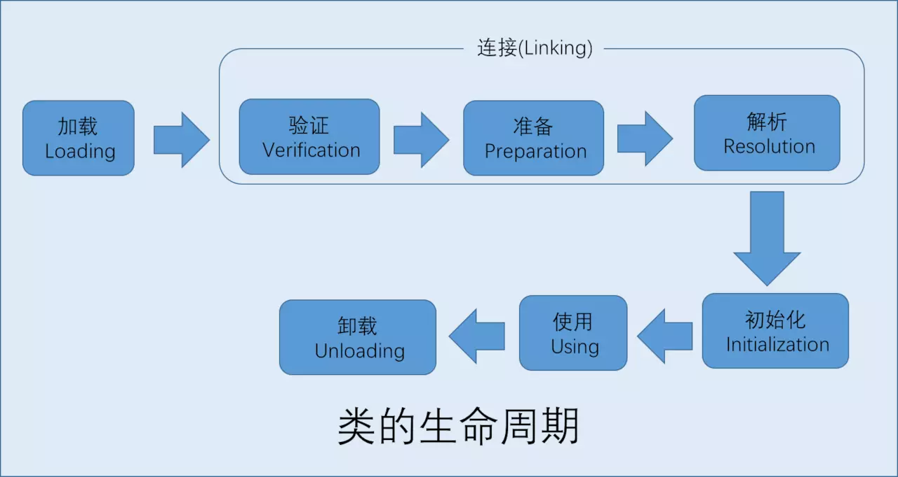

其中加载、验证、准备、初始化和卸载这五个阶段的顺序是确定的。解析阶段可以在初始化之后再开始(运行时绑定或动态绑定或晚期绑定)。

以下五种情况必须对类进行初始化(而加载、验证、准备自然需要在此之前完成)：

- 遇到 new、getstatic、putstatic 或 invokestatic 这 4 条字节码指令时没初始化触发初始化。使用场景：使用 new 关键字实例化对象、读取一个类的静态字段(被 final 修饰、已在编译期把结果放入常量池的静态字段除外)、调用一个类的静态方法。
- 使用 java.lang.reflect 包的方法对类进行反射调用的时候。
- 当初始化一个类的时候，如果发现其父类还没有进行初始化，则需先触发其父类的初始化。
- 当虚拟机启动时，用户需指定一个要加载的主类(包含 main() 方法的那个类)，虚拟机会先初始化这个主类。
- 当使用 JDK 1.7 的动态语言支持时，如果一个 java.lang.invoke.MethodHandle 实例最后的解析结果 REF_getStatic、REF_putStatic、REF_invokeStatic 的方法句柄，并且这个方法句柄所对应的类没有进行过初始化，则需先触发其初始化。

举个例子

```java
public class SuperClass {
    static {
        System.out.println("SuperClass init!");
    }
    public static int value = 1127;
}
public class SubClass extends SuperClass {
    static {
        System.out.println("SubClass init!");
    }
}
public class ConstClass {
    static {
        System.out.println("ConstClass init!");
    }
    public static final String HELLOWORLD = "hello world!"
}
public class NotInitialization {
    public static void main(String[] args) {
        System.out.println(SubClass.value);
        /**
         *  output : SuperClass init!
         *
         * 通过子类引用父类的静态对象不会导致子类的初始化
         * 只有直接定义这个字段的类才会被初始化
         */
        SuperClass[] sca = new SuperClass[10];
        /**
         *  output :
         *
         * 通过数组定义来引用类不会触发此类的初始化
         * 虚拟机在运行时动态创建了一个数组类
         */
        System.out.println(ConstClass.HELLOWORLD);
        /**
         *  output :
         *
         * 常量在编译阶段会存入调用类的常量池当中，本质上并没有直接引用到定义类常量的类，
         * 因此不会触发定义常量的类的初始化。
         * “hello world” 在编译期常量传播优化时已经存储到 NotInitialization 常量池中了。
         */
    }
}
```

### 4.2 类的加载过程

#### 4.2.1 加载

- 通过一个类的全限定名来获取定义次类的二进制流(ZIP 包、网络、运算生成、JSP 生成、数据库读取)。
- 将这个字节流所代表的静态存储结构转化为方法区的运行时数据结构。
- 在内存中生成一个代表这个类的 java.lang.Class 对象，作为方法去这个类的各种数据的访问入口。

数组类的特殊性：数组类本身不通过类加载器创建，它是由 Java 虚拟机直接创建的。但数组类与类加载器仍然有很密切的关系，因为数组类的元素类型最终是要靠类加载器去创建的，数组创建过程如下：

- 如果数组的组件类型是引用类型，那就递归采用类加载加载。
- 如果数组的组件类型不是引用类型，Java 虚拟机会把数组标记为引导类加载器关联。
- 数组类的可见性与他的组件类型的可见性一致，如果组件类型不是引用类型，那数组类的可见性将默认为 public。

内存中实例的 java.lang.Class 对象存在方法区中。作为程序访问方法区中这些类型数据的外部接口。
加载阶段与连接阶段的部分内容是交叉进行的，但是开始时间保持先后顺序。

#### 4.2.2 验证

> 是连接的第一步，确保 Class 文件的字节流中包含的信息符合当前虚拟机要求。

文件格式验证

- 是否以魔数 0xCAFEBABE 开头
- 主、次版本号是否在当前虚拟机处理范围之内
- 常量池的常量是否有不被支持常量的类型（检查常量 tag 标志）
- 指向常量的各种索引值中是否有指向不存在的常量或不符合类型的常量
- CONSTANT_Utf8_info 型的常量中是否有不符合 UTF8 编码的数据
- Class 文件中各个部分集文件本身是否有被删除的附加的其他信息

只有通过这个阶段的验证后，字节流才会进入内存的方法区进行存储，所以后面 3 个验证阶段全部是基于方法区的存储结构进行的，不再直接操作字节流。

元数据验证

- 这个类是否有父类（除 java.lang.Object 之外）
- 这个类的父类是否继承了不允许被继承的类（final 修饰的类）
- 如果这个类不是抽象类，是否实现了其父类或接口之中要求实现的所有方法
- 类中的字段、方法是否与父类产生矛盾（覆盖父类 final 字段、出现不符合规范的重载）

这一阶段主要是对类的元数据信息进行语义校验，保证不存在不符合 Java 语言规范的元数据信息。

字节码验证

- 保证任意时刻操作数栈的数据类型与指令代码序列都配合工作（不会出现按照 long 类型读一个 int 型数据）
- 保证跳转指令不会跳转到方法体以外的字节码指令上
- 保证方法体中的类型转换是有效的（子类对象赋值给父类数据类型是安全的，反过来不合法的）

这是整个验证过程中最复杂的一个阶段，主要目的是通过数据流和控制流分析，确定程序语义是合法的、符合逻辑的。这个阶段对类的方法体进行校验分析，保证校验类的方法在运行时不会做出危害虚拟机安全的事件。

符号引用验证

- 符号引用中通过字符创描述的全限定名是否能找到对应的类
- 在指定类中是否存在符方法的字段描述符以及简单名称所描述的方法和字段
- 符号引用中的类、字段、方法的访问性（private、protected、public、default）是否可被当前类访问

最后一个阶段的校验发生在迅疾将符号引用转化为直接引用的时候，这个转化动作将在连接的第三阶段——解析阶段中发生。符号引用验证可以看做是对类自身以外（常量池中的各种符号引用）的信息进行匹配性校验，还有以上提及的内容。
符号引用的目的是确保解析动作能正常执行，如果无法通过符号引用验证将抛出一个 java.lang.IncompatibleClass.ChangeError 异常的子类。如 java.lang.IllegalAccessError、java.lang.NoSuchFieldError、java.lang.NoSuchMethodError 等。

#### 4.2.3 准备

> 这个阶段正式为类分配内存并设置类变量初始值，内存在方法去中分配(含 static 修饰的变量不含实例变量)。

public static int value = 1127;
这句代码在初始值设置之后为 0，因为这时候尚未开始执行任何 Java 方法。而把 value 赋值为 1127 的 putstatic 指令是程序被编译后，存放于 clinit() 方法中，所以初始化阶段才会对 value 进行赋值。

基本数据类型的零值

数据类型|零值|数据类型|零值
:-:|:-:|:-:|:-:
int|0|boolean|false
long|0L|float|0.0f
short|(short) 0|double|0.0d
char|'\u0000'|reference|null
byte|(byte) 0

**特殊情况：** 如果类字段的字段属性表中存在 ConstantValue 属性，在准备阶段虚拟机就会根据 ConstantValue 的设置将 value 赋值为 1127。

#### 4.2.4 解析

> 这个阶段是虚拟机将常量池内的符号引用替换为直接引用的过程。

符号引用
符号引用以一组符号来描述所引用的目标，符号可以使任何形式的字面量。
直接引用
直接引用可以使直接指向目标的指针、相对偏移量或是一个能间接定位到目标的句柄。直接引用和迅疾的内存布局实现有关

解析动作主要针对类或接口、字段、类方法、接口方法、方法类型、方法句柄和调用点限定符 7 类符号引用进行，分别对应于常量池的 7 种常量类型。

#### 4.2.5 初始化

> 前面过程都是以虚拟机主导，而初始化阶段开始执行类中的 Java 代码。

### 4.3 类加载器

> 通过一个类的全限定名来获取描述此类的二进制字节流。

#### 4.3.1 双亲委派模型

> 从 Java 虚拟机角度讲，只存在两种类加载器：一种是启动类加载器（C++ 实现，是虚拟机的一部分）；另一种是其他所有类的加载器（Java 实现，独立于虚拟机外部且全继承自 java.lang.ClassLoader）

启动类加载器
加载 lib 下或被 -Xbootclasspath 路径下的类

扩展类加载器
加载 lib/ext 或者被 java.ext.dirs 系统变量所指定的路径下的类

引用程序类加载器
ClassLoader负责，加载用户路径上所指定的类库。

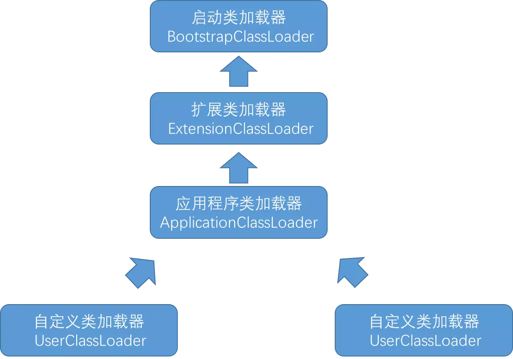

除顶层启动类加载器之外，其他都有自己的父类加载器。
工作过程：如果一个类加载器收到一个类加载的请求，它首先不会自己加载，而是把这个请求委派给父类加载器。只有父类无法完成时子类才会尝试加载。

#### 4.3.2 破坏双亲委派模型

keyword：线程上下文加载器(Thread Context ClassLoader)