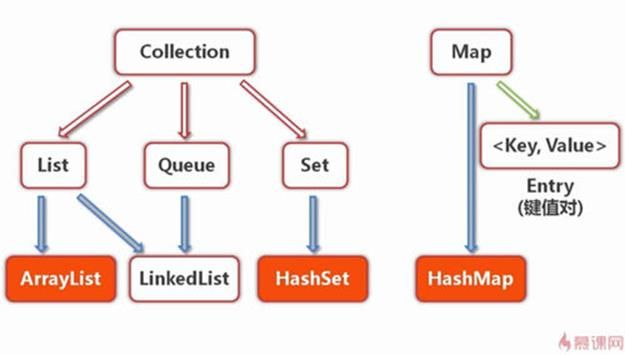

## 1. Java集合类基本概念

&emsp;在编程中，常常需要集中存放多个数据。从传统意义上讲，数组是我们的一个很好的选择，前提是我们事先已经明确知道我们将要保存的对象的数量。一旦在数组初始化时指定了这个数组长度，这个数组长度就是不可变的，如果我们需要保存一个可以动态增长的数据(在编译时无法确定具体的数量)，java的集合类就是一个很好的设计方案了。

&emsp;集合类主要负责保存、盛装其他数据，因此集合类也被称为容器类。所以的集合类都位于java.util包下，后来为了处理多线程环境下的并发安全问题，java5还在java.util.concurrent包下提供了一些多线程支持的集合类。

&emsp;在学习Java中的集合类的API、编程原理的时候，我们一定要明白，"集合"是一个很古老的数学概念，它远远早于Java的出现。从数学概念的角度来理解集合能帮助我们更好的理解编程中什么时候该使用什么类型的集合类。



Java容器类类库的用途是"保存对象"，并将其划分为两个不同的概念：

### 1) Collection

一组"对立"的元素，通常这些元素都服从某种规则

- 1.1) List必须保持元素特定的顺序

- 1.2) Set不能有重复元素

- 1.3) Queue保持一个队列(先进先出)的顺序

### 2) Map

一组成对的"键值对"对象

Collection和Map的区别在于容器中每个位置保存的元素个数:

- 1) Collection 每个位置只能保存一个元素(对象)
- 2) Map保存的是"键值对"，就像一个小型数据库。我们可以通过"键"找到该键对应的"值"

## 2. Java集合类架构层次关系

### 1）Interface Iterable

> 迭代器接口，这是Collection类的父接口。实现这个Iterable接口的对象允许使用foreach进行遍历，也就是说，所有的Collection集合对象都具有"foreach可遍历性"。这个Iterable接口只有一个方法: iterator()。它返回一个代表当前集合对象的泛型< T >迭代器，用于之后的遍历操作

#### 1.1 Collection

> Collection是最基本的集合接口，一个Collection代表一组Object的集合，这些Object被称作Collection的元素。Collection是一个接口，用以提供规范定义，不能被实例化使用

##### 1) Set

> Set集合类似于一个罐子，"丢进"Set集合里的多个对象之间没有明显的顺序。Set继承自Collection接口，不能包含有重复元素(记住，这是整个Set类层次的共有属性)。

Set判断两个对象相同不是使用"=="运算符，而是根据equals方法。也就是说，我们在加入一个新元素的时候，如果这个新元素对象和Set中已有对象进行注意equals比较都返回false，　　
则Set就会接受这个新元素对象，否则拒绝。

因为Set的这个制约，在使用Set集合的时候，应该注意两点：

- 1) 为Set集合里的元素的实现类实现一个有效的equals(Object)方法

- 2) 对Set的构造函数，传入的Collection参数不能包
　　含重复的元素

###### 1.1) HashSet

> HashSet是Set接口的典型实现，HashSet使用HASH算法来存储集合中的元素，因此具有良好的存取和查找性能。当向HashSet集合中存入一个元素时，HashSet会调用该对象的hashCode()方法来得到该对象的hashCode值，然后根据该HashCode值决定该对象在HashSet中的存储位置。

值得主要的是，HashSet集合判断两个元素相等的标准是两个对象通过equals()方法比较相等，并且两个对象的hashCode()方法的返回值相等

- 1.1.1) LinkedHashSet

> LinkedHashSet集合也是根据元素的hashCode值来决定元素的存储位置，但和HashSet不同的是，它同时使用链表维护元素的次序，这样使得元素看起来是以插入的顺序保存的。当遍历LinkedHashSet集合里的元素时,LinkedHashSet将会按元素的添加顺序来访问集合里的元素。

LinkedHashSet需要维护元素的插入顺序，因此性能略低于HashSet的性能，但在迭代访问Set里的全部元素时(遍历)将有很好的性能(链表很适合进行遍历)

###### 1.2) SortedSet

> 此接口主要用于排序操作，即实现此接口的子类都属于排序的子类

- 1.2.1) TreeSet

> TreeSet是SortedSet接口的实现类，TreeSet可以确保集合元素处于排序状态

###### 1.3) EnumSet

> EnumSet是一个专门为枚举类设计的集合类，EnumSet中所有元素都必须是指定枚举类型的枚举值，该枚举类型在创建EnumSet时显式、或隐式地指定。EnumSet的集合元素也是有序的，
它们以枚举值在Enum类内的定义顺序来决定集合元素的顺序

##### 2) List

> List集合代表一个元素有序、可重复的集合，集合中每个元素都有其对应的顺序索引。List集合允许加入重复元素，因为它可以通过索引来访问指定位置的集合元素。List集合默认按元素的添加顺序设置元素的索引

###### 2.1) ArrayList

> ArrayList是基于数组实现的List类，它封装了一个动态的增长的、允许再分配的Object[]数组。

###### 2.2) Vector

> Vector和ArrayList在用法上几乎完全相同，但由于Vector是一个古老的集合，所以Vector提供了一些方法名很长的方法，但随着JDK1.2以后，java提供了系统的集合框架，就将
Vector改为实现List接口，统一归入集合框架体系中

- 2.2.1) Stack

> Stack是Vector提供的一个子类，用于模拟"栈"这种数据结构(LIFO后进先出)

###### 2.3) LinkedList

> implements List< E >, Deque< E >。实现List接口，能对它进行队列操作，即可以根据索引来随机访问集合中的元素。同时它还实现Deque接口，即能将LinkedList当作双端队列
使用。自然也可以被当作"栈来使用"

##### 3) Queue

> Queue用于模拟"队列"这种数据结构(先进先出 FIFO)。队列的头部保存着队列中存放时间最长的元素，队列的尾部保存着队列中存放时间最短的元素。新元素插入(offer)到队列的尾部，访问元素(poll)操作会返回队列头部的元素，队列不允许随机访问队列中的元素。结合生活中常见的排队就会很好理解这个概念

###### 3.1) PriorityQueue

> PriorityQueue并不是一个比较标准的队列实现，PriorityQueue保存队列元素的顺序并不是按照加入队列的顺序，而是按照队列元素的大小进行重新排序，这点从它的类名也可以看出来。

###### 3.2) Deque

> Deque接口代表一个"双端队列"，双端队列可以同时从两端来添加、删除元素，因此Deque的实现类既可以当成队列使用、也可以当成栈使用

- 3.2.1) ArrayDeque

> 是一个基于数组的双端队列，和ArrayList类似，它们的底层都采用一个动态的、可重分配的Object[]数组来存储集合元素，当集合元素超出该数组的容量时，系统会在底层重新分配一个Object[]数组来存储集合元素

- 3.2.2) LinkedList

> LinkedList基于链表的数据结构,地址是任意的，所以在开辟内存空间的时候不需要等一个连续的地址，对于新增和删除操作add和remove，LinedList比较占优势。

#### Map

> Map用于保存具有"映射关系"的数据，因此Map集合里保存着两组值，一组值用于保存Map里的key，另外一组值用于保存Map里的value。key和value都可以是任何引用类型的数据。Map的key不允许重复，即同一个Map对象的任何两个key通过equals方法比较结果总是返回false。关于Map，我们要从代码复用的角度去理解，java是先实现了Map，然后通过包装了一个所有value都为null的Map就实现了Set集合

Map的这些实现类和子接口中key集的存储形式和Set集合完全相同(即key不能重复)

Map的这些实现类和子接口中value集的存储形式和List非常类似(即value可以重复、根据索引来查找)

##### 1) HashMap

> 和HashSet集合不能保证元素的顺序一样，HashMap也不能保证key-value对的顺序。并且类似于HashSet判断两个key是否相等的标准也是: 两个key通过equals()方法比较返回true、
同时两个key的hashCode值也必须相等

###### 1.1) LinkedHashMap

> LinkedHashMap也使用双向链表来维护key-value对的次序，该链表负责维护Map的迭代顺序，与key-value对的插入顺序一致(注意和TreeMap对所有的key-value进行排序进行区
分)

##### 2) Hashtable

> 是一个古老的Map实现类

###### 2.1) Properties

> Properties对象在处理属性文件时特别方便(windows平台上的.ini文件)，Properties类可以把Map对象和属性文件关联起来，从而可以把Map对象中的key-value对写入到属性文件中，也可以把属性文件中的"属性名-属性值"加载到Map对象中

##### 3) SortedMap

> 正如Set接口派生出SortedSet子接口，SortedSet接口有一个TreeSet实现类一样，Map接口也派生出一个SortedMap子接口，SortedMap接口也有一个TreeMap实现类

###### 3.1) TreeMap

> TreeMap就是一个红黑树数据结构，每个key-value对即作为红黑树的一个节点。TreeMap存储key-value对(节点)时，需要根据key对节点进行排序。TreeMap可以保证所有的
key-value对处于有序状态。同样，TreeMap也有两种排序方式: 自然排序、定制排序

##### 4) WeakHashMap

> WeakHashMap与HashMap的用法基本相似。区别在于，HashMap的key保留了对实际对象的"强引用"，这意味着只要该HashMap对象不被销毁，该HashMap所引用的对象就不会被垃圾回收。但WeakHashMap的key只保留了对实际对象的弱引用，这意味着如果WeakHashMap对象的key所引用的对象没有被其他强引用变量所引用，则这些key所引用的对象可能被垃圾回收，当垃圾回收了该key所对应的实际对象之后，WeakHashMap也可能自动删除这些key所对应的key-value对

##### 5) IdentityHashMap

> IdentityHashMap的实现机制与HashMap基本相似，在IdentityHashMap中，当且仅当两个key严格相等(key1 == key2)时，IdentityHashMap才认为两个key相等

##### 6) EnumMap

> EnumMap是一个与枚举类一起使用的Map实现，EnumMap中的所有key都必须是单个枚举类的枚举值。创建EnumMap时必须显式或隐式指定它对应的枚举类。EnumMap根据key的自然顺序
(即枚举值在枚举类中的定义顺序)

## 3. Java集合类的应用场景代码

### HashSet

```java
import java.util.*;
//类A的equals方法总是返回true,但没有重写其hashCode()方法。不能保证当前对象是HashSet中的唯一对象class A
{
    public boolean equals(Object obj)
    {
        return true;
    }
}
//类B的hashCode()方法总是返回1,但没有重写其equals()方法。不能保证当前对象是HashSet中的唯一对象class B
{
    public int hashCode()
    {
        return 1;
    }
}
//类C的hashCode()方法总是返回2,且有重写其equals()方法class C
{
    public int hashCode()
    {
        return 2;
    }
    public boolean equals(Object obj)
    {
        return true;
    }
}public class HashSetTest
{
    public static void main(String[] args)
    {
        HashSet books = new HashSet();
        //分别向books集合中添加两个A对象，两个B对象，两个C对象
        books.add(new A());
        books.add(new A());
        books.add(new B());
        books.add(new B());
        books.add(new C());
        books.add(new C());
        System.out.println(books);
    }
}
result:
[B@1, B@1, C@2, A@3bc257, A@785d65]
```

可以看到，如果两个对象通过equals()方法比较返回true，但这两个对象的hashCode()方法返回不同的hashCode值时，这将导致HashSet会把这两个对象保存在Hash表的不同位置，从而使对象可以添加成功，这就与Set集合的规则有些出入了。所以，我们要明确的是: equals()决定是否可以加入HashSet、而hashCode()决定存放的位置，它们两者必须同时满足才能允许一个新元素加入HashSet
但是要注意的是: 如果两个对象的hashCode相同，但是它们的equlas返回值不同，HashSet会在这个位置用链式结构来保存多个对象。而HashSet访问集合元素时也是根据元素的HashCode值来快速定位的，这种链式结构会导致性能下降。
所以如果需要把某个类的对象保存到HashSet集合中，我们在重写这个类的equlas()方法和hashCode()方法时，应该尽量保证两个对象通过equals()方法比较返回true时，它们的hashCode()方法返回值也相等

### LinkedHashSet

```java
import java.util.*;
public class LinkedHashSetTest
{
    public static void main(String[] args)
    {
        LinkedHashSet books = new LinkedHashSet();
        books.add("Java");
        books.add("LittleHann");
        System.out.println(books);
        //删除 Java
      books.remove("Java");
        //重新添加 Java
        books.add("Java");
        System.out.println(books);
    }
}
```

元素的顺序总是与添加顺序一致，同时要明白的是，LinkedHashSetTest是HashSet的子类，因此它不允许集合元素重复

### TreeSet

```java
import java.util.*;
public class TreeSetTest
{
    public static void main(String[] args)
    {
        TreeSet nums = new TreeSet();
        //向TreeSet中添加四个Integer对象
        nums.add(5);
        nums.add(2);
        nums.add(10);
        nums.add(-9);
        //输出集合元素，看到集合元素已经处于排序状态
        System.out.println(nums);
        //输出集合里的第一个元素
        System.out.println(nums.first());
        //输出集合里的最后一个元素
        System.out.println(nums.last());
        //返回小于4的子集，不包含4
        System.out.println(nums.headSet(4));
        //返回大于5的子集，如果Set中包含5，子集中还包含5
        System.out.println(nums.tailSet(5));
        //返回大于等于-3，小于4的子集。
        System.out.println(nums.subSet(-3 , 4));
    }
}
```

与HashSet集合采用hash算法来决定元素的存储位置不同，TreeSet采用红黑树的数据结构来存储集合元素。TreeSet支持两种排序方式: 自然排序、定制排序

- 自然排序:

> TreeSet会调用集合元素的compareTo(Object obj)方法来比较元素之间的大小关系，然后将集合元素按升序排序，即自然排序。如果试图把一个对象添加到TreeSet时，则该对象的类必须实现Comparable接口，否则程序会抛出异常。当把一个对象加入TreeSet集合中时，TreeSet会调用该对象的compareTo(Object obj)方法与容器中的其他对象比较大小，然后根据红黑树结构找到它的存储位置。如果两个对象通过compareTo(Object obj)方法比较相等，新对象将无法添加到TreeSet集合中(牢记Set是不允许重复的概念)。

注意: 当需要把一个对象放入TreeSet中，重写该对象对应类的equals()方法时，应该保证该方法与compareTo(Object obj)方法有一致的结果，即如果两个对象通过equals()方法比较返回true时，这两个对象通过compareTo(Object obj)方法比较结果应该也为0(即相等)

看到这里，我们应该明白：

1) 对与Set来说，它定义了equals()为唯一性判断的标准，而对于到了具体的实现，HashSet、TreeSet来说，它们又会有自己特有的唯一性判断标准，只有同时满足了才能判定为唯一性

2) 我们在操作这些集合类的时候，对和唯一性判断有关的函数重写要重点关注

- 定制排序

> TreeSet的自然排序是根据集合元素的大小，TreeSet将它们以升序排序。如果我们需要实现定制排序，则可以通过Comparator接口的帮助(类似PHP中的array_map回调处理函数的思想)。该接口里包含一个int compare(T o1， T o2)方法，该方法用于比较大小

```java
import java.util.*;
class M
{
    int age;
    public M(int age)
    {
        this.age = age;
    }
    public String toString()
    {
        return "M[age:" + age + "]";
    }
}
public class TreeSetTest4
{
    public static void main(String[] args)
    {
        TreeSet ts = new TreeSet(new Comparator()
        {
            //根据M对象的age属性来决定大小
            public int compare(Object o1, Object o2)
            {
                M m1 = (M)o1;
                M m2 = (M)o2;
                return m1.age > m2.age ? -1
                    : m1.age < m2.age ? 1 : 0;
            }
        });
        ts.add(new M(5));
        ts.add(new M(-3));
        ts.add(new M(9));
        System.out.println(ts);
    }
}
```

1) equals、compareTo决定的是怎么比的问题，即用什么field进行大小比较
2) 自然排序、定制排序、Comparator决定的是谁大的问题，即按什么顺序(升序、降序)进行排序它们的关注点是不同的，一定要注意区分

### EnumSet

```java
import java.util.*;
enum Season
{
    SPRING,SUMMER,FALL,WINTER
}public class EnumSetTest
{
    public static void main(String[] args)
    {
        //创建一个EnumSet集合，集合元素就是Season枚举类的全部枚举值
        EnumSet es1 = EnumSet.allOf(Season.class);
        //输出[SPRING,SUMMER,FALL,WINTER]
        System.out.println(es1);
        //创建一个EnumSet空集合，指定其集合元素是Season类的枚举值。
        EnumSet es2 = EnumSet.noneOf(Season.class);
        //输出[]
        System.out.println(es2);
        //手动添加两个元素        es2.add(Season.WINTER);
        es2.add(Season.SPRING);
        //输出[SPRING,WINTER]
        System.out.println(es2);
        //以指定枚举值创建EnumSet集合
        EnumSet es3 = EnumSet.of(Season.SUMMER , Season.WINTER);
        //输出[SUMMER,WINTER]
        System.out.println(es3);
        EnumSet es4 = EnumSet.range(Season.SUMMER , Season.WINTER);
        //输出[SUMMER,FALL,WINTER]
        System.out.println(es4);
        //新创建的EnumSet集合的元素和es4集合的元素有相同类型，
        //es5的集合元素 + es4集合元素 = Season枚举类的全部枚举值
        EnumSet es5 = EnumSet.complementOf(es4);
        //输出[SPRING]
        System.out.println(es5);
    }
}
```

以上就是Set集合类的编程应用场景。那么应该怎样选择何时使用这些集合类呢？

1) HashSet的性能总是比TreeSet好(特别是最常用的添加、查询元素等操作)，因为TreeSet需要额外的红黑树算法来维护集合元素的次序。只有当需要一个保持排序的Set时，才应该使用TreeSet，否则都应该使用HashSet

2) 对于普通的插入、删除操作，LinkedHashSet比HashSet要略慢一点，这是由维护链表所带来的开销造成的。不过，因为有了链表的存在，遍历LinkedHashSet会更快

3) EnumSet是所有Set实现类中性能最好的，但它只能保存同一个枚举类的枚举值作为集合元素

4) HashSet、TreeSet、EnumSet都是"线程不安全"的，通常可以通过Collections工具类的synchronizedSortedSet方法来"包装"该Set集合。

```java
SortedSet s = Collections.synchronizedSortedSet(new TreeSet(...));
```

### ArrayList

如果一开始就知道ArrayList集合需要保存多少元素，则可以在创建它们时就指定initialCapacity大小，这样可以减少重新分配的次数，提供性能，ArrayList还提供了如下方法来重新分配Object[]数组

1) ensureCapacity(int minCapacity): 将ArrayList集合的Object[]数组长度增加minCapacity

2) trimToSize(): 调整ArrayList集合的Object[]数组长度为当前元素的个数。程序可以通过此方法来减少ArrayList集合对象占用的内存空间

```java
import java.util.*;
public class ListTest
{
    public static void main(String[] args)
    {
        List books = new ArrayList();
        //向books集合中添加三个元素
        books.add(new String("轻量级Java EE应用"));
        books.add(new String("疯狂Java"));
        books.add(new String("疯狂Android"));
        System.out.println(books);
        //将新字符串对象插入在第二个位置
        books.add(1 , new String("疯狂Ajax"));
        for (int i = 0 ; i < books.size() ; i++ )
        {
            System.out.println(books.get(i));
        }
        //删除第三个元素
        books.remove(2);
        System.out.println(books);
        //判断指定元素在List集合中位置：输出1，表明位于第二位
        System.out.println(books.indexOf(new String("疯狂Ajax")));  //①
        //将第二个元素替换成新的字符串对象
        books.set(1, new String("LittleHann"));
        System.out.println(books);
        //将books集合的第二个元素（包括）
        //到第三个元素（不包括）截取成子集合
        System.out.println(books.subList(1 , 2));
    }
```

List集合类的编程应用场景。我们来梳理一下

1. java提供的List就是一个"线性表接口"，ArrayList(基于数组的线性表)、LinkedList(基于链的线性表)是线性表的两种典型实现

2. 因为数组以一块连续内存来保存所有的数组元素，所以数组在随机访问时性能最好。所以的内部以数组作为底层实现的集合在随机访问时性能最好。

3. 内部以链表作为底层实现的集合在执行插入、删除操作时有很好的性能

4. 进行迭代操作时，以链表作为底层实现的集合比以数组作为底层实现的集合性能好

我们之前说过，Collection接口继承了Iterable接口，也就是说，我们以上学习到的所有的Collection集合类都具有"可遍历性"

Iterable接口也是java集合框架的成员，它隐藏了各种Collection实现类的底层细节，向应用程序提供了遍历Collection集合元素的统一编程接口:

1) boolean hasNext(): 是否还有下一个未遍历过的元素

2) Object next(): 返回集合里的下一个元素

3) void remove(): 删除集合里上一次next方法返回的元素

**iterator实现遍历:**

```java
import java.util.*;
public class IteratorTest
{
    public static void main(String[] args)
    {
        //创建一个集合
        Collection books = new HashSet();
        books.add("轻量级Java EE应用");
        books.add("疯狂Java");
        books.add("疯狂Android");
        //获取books集合对应的迭代器
        Iterator it = books.iterator();
        while(it.hasNext())
        {
            //it.next()方法返回的数据类型是Object类型，
            //需要强制类型转换
            String book = (String)it.next();
            System.out.println(book);
            if (book.equals("疯狂Java"))
            {
                //从集合中删除上一次next方法返回的元素                it.remove();
            }
            //对book变量赋值，不会改变集合元素本身
            book = "测试字符串";
        }
        System.out.println(books);
    }
}
```

从代码可以看出，iterator必须依附于Collection对象，若有一个iterator对象，必然有一个与之关联的Collection对象。

除了可以使用iterator接口迭代访问Collection集合里的元素之外，使用java5提供的foreach循环迭代访问集合元素更加便捷

**foreach实现遍历:**

```java
import java.util.*;
public class ForeachTest
{
    public static void main(String[] args)
    {
        //创建一个集合
        Collection books = new HashSet();
        books.add(new String("轻量级Java EE应用"));
        books.add(new String("疯狂Java"));
        books.add(new String("疯狂Android"));
        for (Object obj : books)
        {
            //此处的book变量也不是集合元素本身
            String book = (String)obj;
            System.out.println(book);
            if (book.equals("疯狂Android"))
            {
                //下面代码会引发ConcurrentModificationException异常
                //books.remove(book);                  }
        }
        System.out.println(books);
    }
}
```

除了Collection固有的iterator()方法，List还额外提供了一个listIterator()方法，该方法返回一个ListIterator对象，ListIterator接口继承了Iterator接口，提供了专门操作List的方法。ListIterator接口在Iterator接口的继承上增加了如下方法:

1) boolean hasPrevious(): 返回该迭代器关联的集合是否还有上一个元素

2) Object previous(): 返回该迭代器的上一个元素(向前迭代)

3) void add(): 在指定位置插入一个元素

**ListIterator实现遍历:**

```java
import java.util.*;
public class ListIteratorTest
{
    public static void main(String[] args)
    {
        String[] books = {
            "疯狂Java",
            "轻量级Java EE应用"
        };
        List bookList = new ArrayList();
        for (int i = 0; i < books.length ; i++ )
        {
            bookList.add(books[i]);
        }
        ListIterator lit = bookList.listIterator();
        while (lit.hasNext())
        {
            System.out.println(lit.next());
            lit.add("-------分隔符-------");
        }
        System.out.println("=======下面开始反向迭代=======");
        while(lit.hasPrevious())
        {
            System.out.println(lit.previous());
        }
    }
}
```

### Map实现

#### HashMap、Hashtable

```java
import java.util.*;
class A
{
    int count;
    public A(int count)
    {
        this.count = count;
    }
    //根据count的值来判断两个对象是否相等。
    public boolean equals(Object obj)
    {
        if (obj == this)
            return true;
        if (obj!=null &&
            obj.getClass()==A.class)
        {
            A a = (A)obj;
            return this.count == a.count;
        }
        return false;
    }
    //根据count来计算hashCode值。
    public int hashCode()
    {
        return this.count;
    }
}class B
{
    //重写equals()方法，B对象与任何对象通过equals()方法比较都相等
    public boolean equals(Object obj)
    {
        return true;
    }
}public class HashtableTest
{
    public static void main(String[] args)
    {
        Hashtable ht = new Hashtable();
        ht.put(new A(60000) , "疯狂Java");
        ht.put(new A(87563) , "轻量级Java EE应用");
        ht.put(new A(1232) , new B());
        System.out.println(ht);
        //只要两个对象通过equals比较返回true，
        //Hashtable就认为它们是相等的value。
        //由于Hashtable中有一个B对象，
        //它与任何对象通过equals比较都相等，所以下面输出true。
        System.out.println(ht.containsValue("测试字符串"));  //①
        //只要两个A对象的count相等，它们通过equals比较返回true，且hashCode相等
        //Hashtable即认为它们是相同的key，所以下面输出true。
        System.out.println(ht.containsKey(new A(87563)));   //②
        //下面语句可以删除最后一个key-value对
        ht.remove(new A(1232));    //③
        //通过返回Hashtable的所有key组成的Set集合，
        //从而遍历Hashtable每个key-value对
        for (Object key : ht.keySet())
        {
            System.out.print(key + "---->");
            System.out.print(ht.get(key) + "\n");
        }
    }
}
```

当使用自定义类作为HashMap、Hashtable的key时，如果重写该类的equals(Object obj)和hashCode()方法，则应该保证两个方法的判断标准一致--当两个key通过equals()方法比较返回true时，两个key的hashCode()的返回值也应该相同

#### LinkedHashMap

```java
import java.util.*;
public class LinkedHashMapTest
{
    public static void main(String[] args)
    {
        LinkedHashMap scores = new LinkedHashMap();
        scores.put("语文" , 80);
        scores.put("英文" , 82);
        scores.put("数学" , 76);
        //遍历scores里的所有的key-value对
        for (Object key : scores.keySet())
        {
            System.out.println(key + "------>" + scores.get(key));
        }
    }
}
```

#### TreeMap

```java
import java.util.*;
class R implements Comparable
{
    int count;
    public R(int count)
    {
        this.count = count;
    }
    public String toString()
    {
        return "R[count:" + count + "]";
    }
    //根据count来判断两个对象是否相等。
    public boolean equals(Object obj)
    {
        if (this == obj)
            return true;
        if (obj!=null
            && obj.getClass()==R.class)
        {
            R r = (R)obj;
            return r.count == this.count;
        }
        return false;
    }
    //根据count属性值来判断两个对象的大小。
    public int compareTo(Object obj)
    {
        R r = (R)obj;
        return count > r.count ? 1 :
            count < r.count ? -1 : 0;
    }
}public class TreeMapTest
{
    public static void main(String[] args)
    {
        TreeMap tm = new TreeMap();
        tm.put(new R(3) , "轻量级Java EE应用");
        tm.put(new R(-5) , "疯狂Java");
        tm.put(new R(9) , "疯狂Android");
        System.out.println(tm);
        //返回该TreeMap的第一个Entry对象
        System.out.println(tm.firstEntry());
        //返回该TreeMap的最后一个key值
        System.out.println(tm.lastKey());
        //返回该TreeMap的比new R(2)大的最小key值。
        System.out.println(tm.higherKey(new R(2)));
        //返回该TreeMap的比new R(2)小的最大的key-value对。
        System.out.println(tm.lowerEntry(new R(2)));
        //返回该TreeMap的子TreeMap
        System.out.println(tm.subMap(new R(-1) , new R(4)));
    }
}
```

从代码中可以看出，类似于TreeSet中判断两个元素是否相等的标准，TreeMap中判断两个key相等的标准是:

1) 两个key通过compareTo()方法返回0

2) equals()放回true

我们在重写这两个方法的时候一定要保证它们的逻辑关系一致。

强调一下:

Set和Map的关系十分密切，java源码就是先实现了HashMap、TreeMap等集合，然后通过包装一个所有的value都为null的Map集合实现了Set集合类

以上就是Map集合类的编程应用场景。我们来梳理一下思路

1) HashMap和Hashtable的效率大致相同，因为它们的实现机制几乎完全一样。但HashMap通常比Hashtable要快一点，因为Hashtable需要额外的线程同步控制

2) TreeMap通常比HashMap、Hashtable要慢(尤其是在插入、删除key-value对时更慢)，因为TreeMap底层采用红黑树来管理key-value对

3) 使用TreeMap的一个好处就是： TreeMap中的key-value对总是处于有序状态，无须专门进行排序操作
