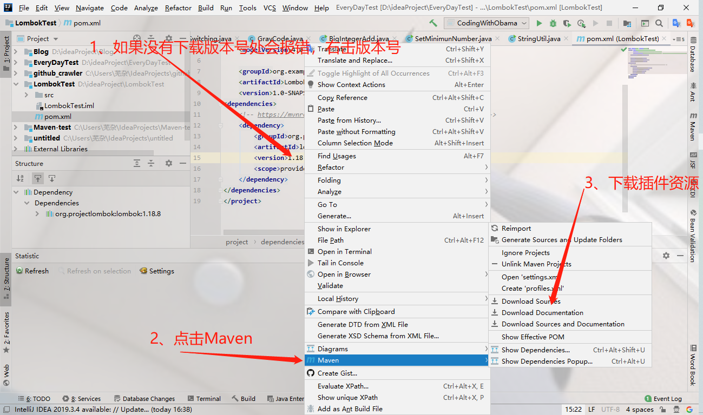

### Lombok到底是什么

先看一下它的官网

**大致意思是**：Lombok项目是一个Java库，它会自动插入您的编辑器和构建工具中，从而为您的Java增光添彩。永远不要再编写另一个getter或equals方法，带有一个注释的类将具有功能全面的生成器，自动执行日志记录变量等等。

听起来好像是挺不错吼，亲自尝试一下吧！

---

### 项目中引入Lombok
<!--more-->
首先在项目的 pom.xml中引入 Lombok依赖：

如果不知道如何导入的话，可以在[MvnRepository](https://mvnrepository.com/)进行查找一下，是不是就很nice。

接下来你就会看到如下界面

**选择安装版本**
一般我们选择使用人数多且不是最新版本的，于是我们选择1.18.8

于是乎我们复制这段代码到pom.xml中引入 Lombok依赖：


```pom
<!-- https://mvnrepository.com/artifact/org.projectlombok/lombok -->
<dependency>
    <groupId>org.projectlombok</groupId>
    <artifactId>lombok</artifactId>
    <version>1.18.8</version>
    <scope>provided</scope>
</dependency>
```

项目中导入
接下来就是愉快的代码环节了。

---

### get/set/toString不用写了

定义一个课程 Course，需要自己手动写上每个字段的 get()和 set()方法以及toString()方法，就像这样：

```java
package Dao;

/**
 * @Author：Eric
 * @Date：2020/3/19 21:02
 */
public class Course {
    private Long id;    // 课程ID
    private String name;    // 课程名称
    private Integer score;  // 课程成绩
    // 自己手写下面的 get/set/toString 方法！
    public void setId(Long id) {
        this.id = id;
    }

    public void setName(String name) {
        this.name = name;
    }

    public void setScore(Integer score) {
        this.score = score;
    }

    public Long getId() {
        return id;
    }

    public String getName() {
        return name;
    }


    public Integer getScore() {
        return score;
    }
    @Override
    public String toString() {
        return "Course{" +
                "id=" + id +
                ", name='" + name + '\'' +
                ", score=" + score +
                '}';
    }
}
```

但是借助于Lombok，一切都变得优雅起来

```java
package Dao;

import lombok.Getter;
import lombok.Setter;
import lombok.ToString;

/**
 * @Author：Eric
 * @Date：2020/3/19 21:02
 */
@ToString
public class Course {
    @Getter
    @Setter
    private Long id;    // 课程ID
    @Getter
    @Setter
    private String name;    // 课程名称
    @Getter
    @Setter
    private Integer score;  // 课程成绩

}
```

三个注解：@Getter、@Setter和@ToString即可方便搞定。

---

### new对象变得优雅了

在没有用Lombok之前，我们假如想new一个对象，我们往往会这么做（以上面的 Course类为例）：

```java
  Course course = new Course(); //首先new一个对象
        //逐步去填充各个字段
    course.setId(124l);
    course.setName("javaWeb");
    course.setScore(100);
```

引进Lombok之后，我们只需要在 Course类上用上 @Builder注解：

```java
@ToString
@Builder
public class Course {
    @Getter
    @Setter
    private Long id;    // 课程ID
    @Getter
    @Setter
    private String name;    // 课程名称
    @Getter
    @Setter
    private Integer score;  // 课程成绩
}
```

则 Course类对象的创建即可使用 链式表达 的方式一行代码完成：

```java
ourse course = Course.builder().id(123l).name("javaWeb").score(100).build();
```

Builder注解就是一个典型的“建造者模式”的实现案例

---

### 构造函数不用写了

1、全参构造器不用写了

当你在你的类上使用了Lombok的注解 AllArgsConstructor时：

```java
package Dao;

import lombok.AllArgsConstructor;
import lombok.Getter;
import lombok.Setter;
import lombok.ToString;

/**
 * @Author：Eric
 * @Date：2020/3/19 21:02
 */
@AllArgsConstructor
public class Course {

    private Long id;    // 课程ID
    private String name;    // 课程名称
    private Integer score;  // 课程成绩

}
```

这时候你的类在编译后会自动生成一个无参构造函数，就像这样：

```java
package Dao;

import lombok.AllArgsConstructor;
import lombok.Getter;
import lombok.Setter;
import lombok.ToString;

/**
 * @Author：Eric
 * @Date：2020/3/19 21:02
 */

public class Course {

    private Long id;    // 课程ID
    private String name;    // 课程名称
    private Integer score;  // 课程成绩

    public Course(Long id, String name, Integer score) {
        this.id = id;
        this.name = name;
        this.score = score;
    }
}
```

2、无参数构造器也不用写了

当你在你的类上使用了Lombok的注解 NoArgsConstructor时：

```java
package Dao;

import lombok.*;

/**
 * @Author：Eric
 * @Date：2020/3/19 21:02
 */
@NoArgsConstructor
public class Course {

    private Long id;    // 课程ID
    private String name;    // 课程名称
    private Integer score;  // 课程成绩

}
```

这时候你的类在编译后会自动生成一个无参构造函数，就像这样：

```java
package Dao;

import lombok.*;

/**
 * @Author：Eric
 * @Date：2020/3/19 21:02
 */

public class Course {

    private Long id;    // 课程ID
    private String name;    // 课程名称
    private Integer score;  // 课程成绩

    // Lombok自动会帮你生成一个无参构造器！！
    public Course() {
    }
}
```

3、部分参数构造器也不用写了

当你在你的类上使用了Lombok的注解 RequiredArgsConstructor时：

```java
package Dao;

import lombok.*;

/**
 * @Author：Eric
 * @Date：2020/3/19 21:02
 */
@RequiredArgsConstructor
public class Course {

    private Long id;    // 课程ID
    private final String name;    // 课程名称
    private Integer score;  // 课程成绩

}
```

这时候你的类在编译后会自动生成一个具备部分参数的构造函数，就像这样：

```java
package Dao;

import lombok.*;

/**
 * @Author：Eric
 * @Date：2020/3/19 21:02
 */

public class Course {

    private Long id;    // 课程ID
    private final String name;    // 课程名称
    private Integer score;  // 课程成绩
    // 因为name字段定义成final，所以Lombok自动会帮你生成一个部分参数的构造器！！
    public Course(String name) {
        this.name = name;
    }
}
```

---

### null判空不用写了

Lombok的 @NonNull注解可以自动帮我们避免空指针判断。该注解作用在方法参数上，用于自动生成空值参数检查，比如：

```java
  public static void JudgeNull(String name){
        if (name == null){
            System.out.println("参数为空");
        }
        System.out.println(name);
    }
```

大批量的判空会不会让你感到烦躁呢？但是有了Lombok之后，事情就变得简单了，一个注解搞定：

```java
 public static void JudgeNull(@NonNull String name){
        System.out.println(name);
    }
```

---

### 再也不用收尾了

比如我们打开一个 txt文本文件亦或是调用Scanner输入：

```java
BufferedReader br = null;
        try {
            FileReader fileReader = null;
            fileReader = new FileReader("Lombok.txt");
            br = new BufferedReader(fileReader);
            try {
                System.out.println(br.readLine());
            } catch (IOException e) {
                e.printStackTrace();
            }

        } catch (FileNotFoundException e) {
            e.printStackTrace();
        }finally {
            try {
                br.close();
            } catch (IOException e) {
                e.printStackTrace();
            }
        }
```

注意，这个文件句柄在使用完成之后是一定要手动 close的，否则就有可能资源泄漏。有了Lombok之后，这些统统不用干了，一个 @Cleanup注解即可搞定。

```java
 @Cleanup BufferedReader br = null;
        FileReader fileReader = null;
        try {
            fileReader = new FileReader("Lombok.txt");
        } catch (FileNotFoundException e) {
            e.printStackTrace();
        }
        br = new BufferedReader(fileReader);
        try {
            System.out.println(br.readLine());
        } catch (IOException e) {
            e.printStackTrace();
        }
```

---

### 异常不用捕捉了

以上面那个作为例子

这地方的 FileNotFoundException异常，要么显式地在函数级抛出，要么就像上面一样 try/catch内部消灭。

如果在编码时，不想处理这种繁杂的异常处理，你可以使用Lombok的 @SneakyThrows注解进行简化，比如上面的代码就可以简化为：

```java
    @SneakyThrows
    public static void OpnTxt( String fileName){
        @Cleanup BufferedReader br = null;
        FileReader fileReader = null;
        fileReader = new FileReader("Lombok.txt");
        br = new BufferedReader(fileReader);
        System.out.println(br.readLine());
    }
```

这样你编码时就无需处理异常了

---

### 还有一些

上面列举了几个平时项目开发中使用非常频繁的Lombok注解，除此之外，还有诸如像：

- @EqualsAndHashCode：为类自动生成hashCode和equals实现
- @Log：为类自动生成log日志记录
- @Synchronized：为类方法或实例方法自动生成synchronized保护

---
从此，代码5分钟，划水2小时不是梦。。。

