[Pycharm、Python](https://pan.baidu.com/s/1tiwcFLKU11WpmJ4flgNjMg)下载
提取码：ided

## 环境安装

### Python安装
<!--more-->
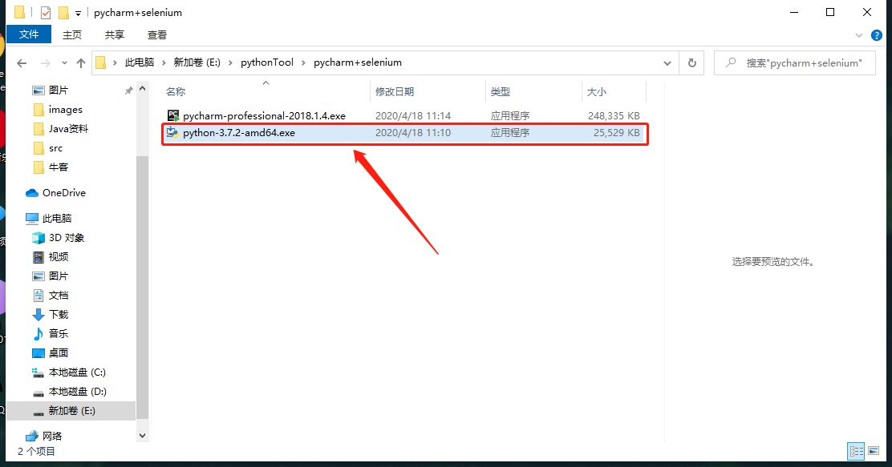

勾选**Add Python to Path**添加环境变量

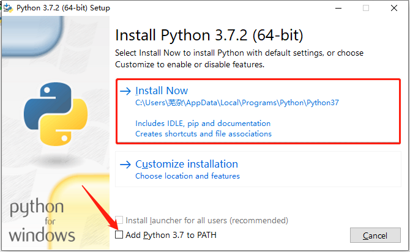

点击**install**进行安装

验证Python和环境变量是否配置成功：

win+r 输入cmd以管理员方式运行，在dos窗口下输入python出现如下窗口则说明你就成功啦
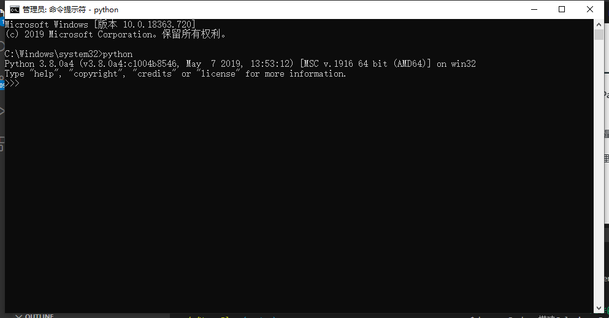

---

### 安装Pycharm

点击安装Pycharm
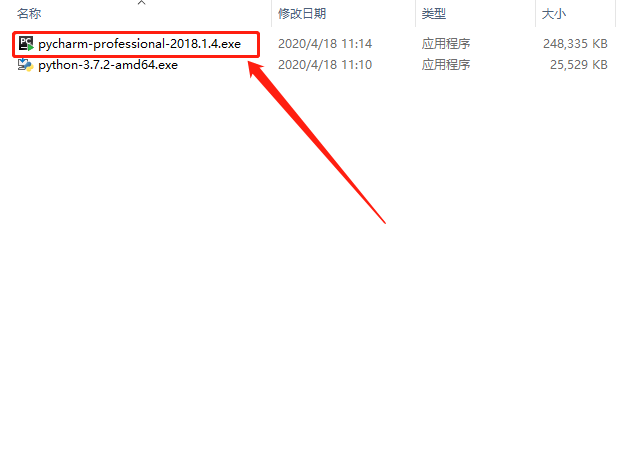

安装好后，点击启动后，点击新建项目，配置Project Interpreter下Base interpreter中选择刚刚安装的python文件，此时创建，则pycharm的python环境搭建完成，参考图见下：
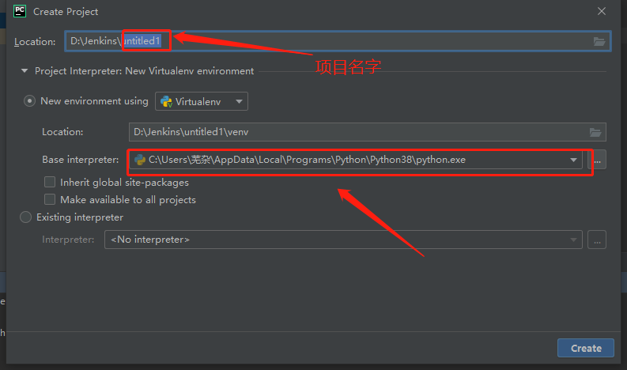

以上pycharm中的python环境已搭建完成，我们现在开始配置selenium环境；

---

### 安装Selenium

点击pycharm的File-Settings-Project:Pycharm-Project Interpreter，点击窗口右侧绿色的“+”按钮，搜索“selenium”，搜索后点击添加，安装OK之后，如图中所示，直接会在窗口中显示
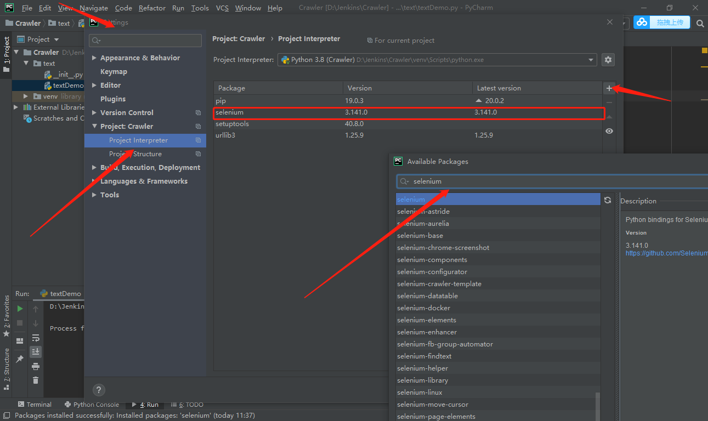

安装成功之后，就会显示在面板上，如下图：
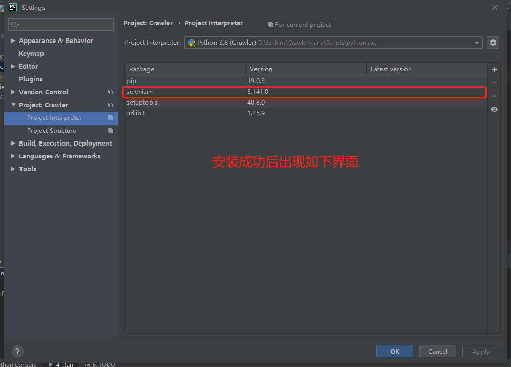

***接下来我们就可以愉快的写我们的自动化测试代码啦！***


## 自动化搭建

### 确定当前浏览器版本

确定好Chrome浏览器版本号，浏览器右上角三个点-帮助-关于Google Chrome，就能看到当前版本号，我的是版本是81.0.4044.113（正式版本）（64 位），确定好之后接下来我们要去找到对应的chromedirver驱动；
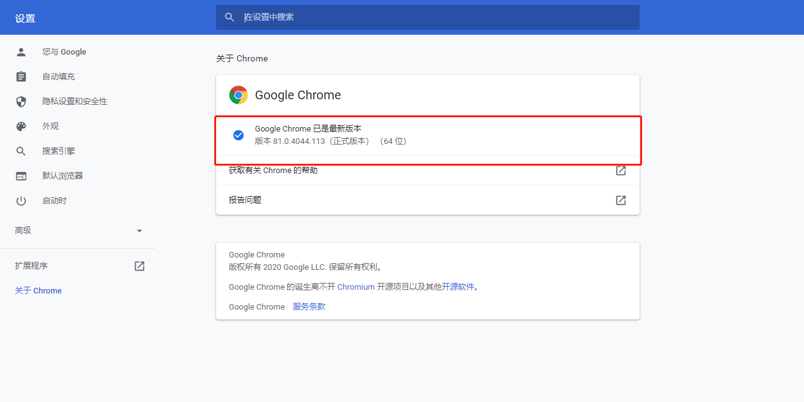

## 下载对应版本驱动chromedriver

这里我们依赖淘宝的镜像下载[ChromeDriver](http://npm.taobao.org/mirrors/chromedriver/)

注意下载的版本要一致，我们这里下载的是81.0.4044.69
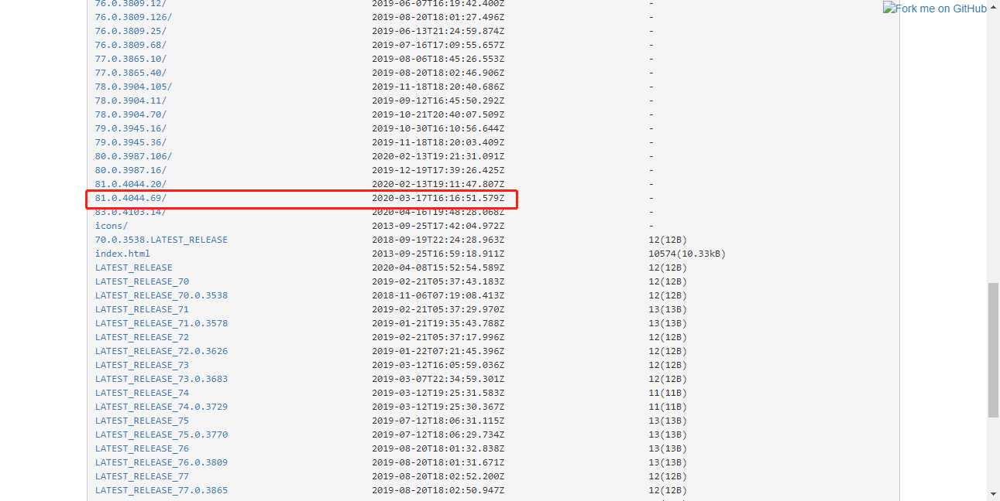

 下载chromedriver后，将chromedriver文件放到python目录下
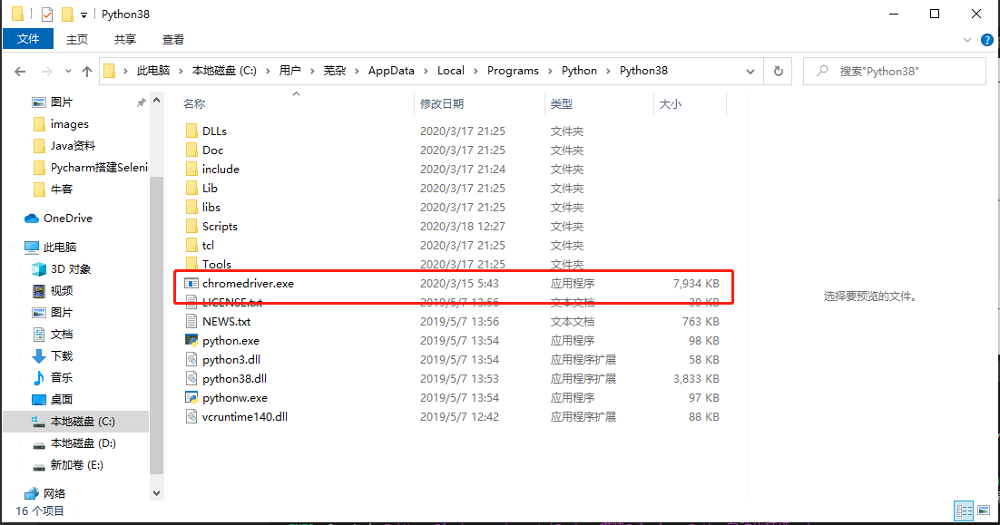

## 用例编写测试

### 启动pycharm，创建一个项目，File-New Project-Location，更改位置，创建test项目

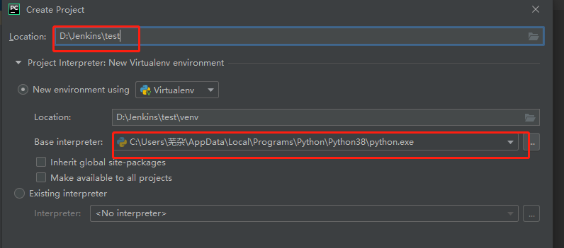

### 在test下创建一个python package

  右击test-New-Python Package，输入包名：testbag;
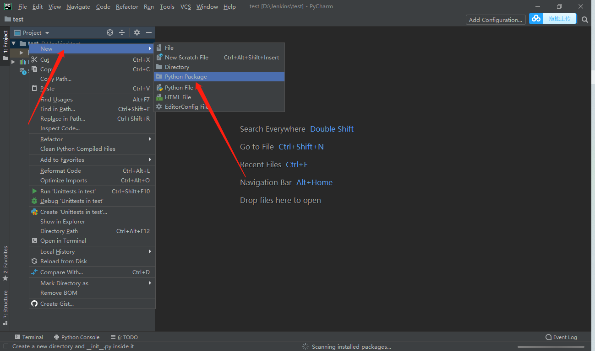

### 包下创建一个Python文件

  右击testbag-New-Python File，输入名字：testDemo
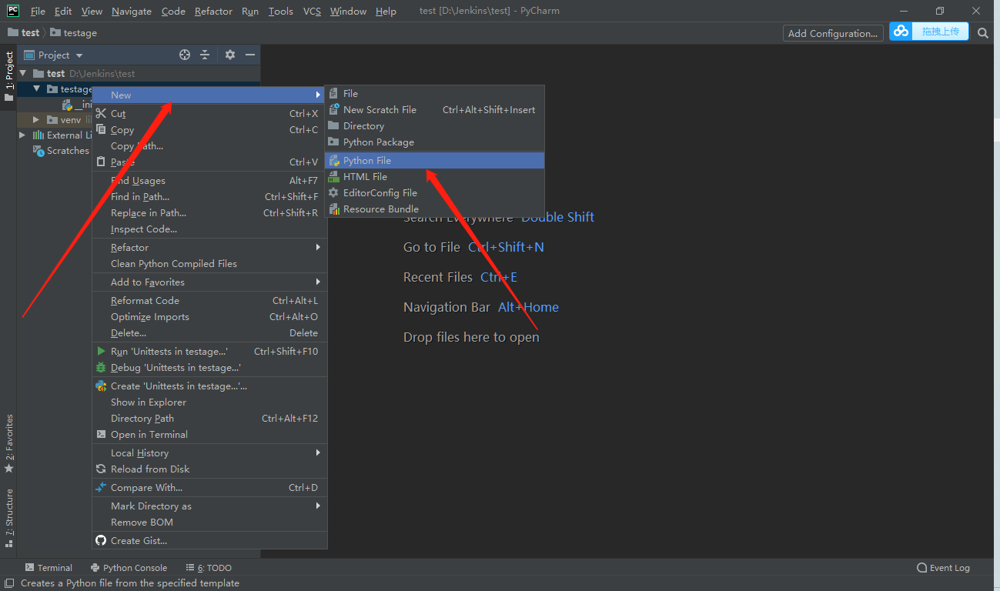

### 写代码通过谷歌浏览器访问[TheOak](http://www.theoak.online/)

```python
from selenium import webdriver
import time

driver = webdriver.Chrome()
driver.get("http://www.theoak.online/")
time.sleep(10)
driver.close()
```

右键直接run就可以了，当浏览器能自动打开，就证明一切OK了，就像这样呀
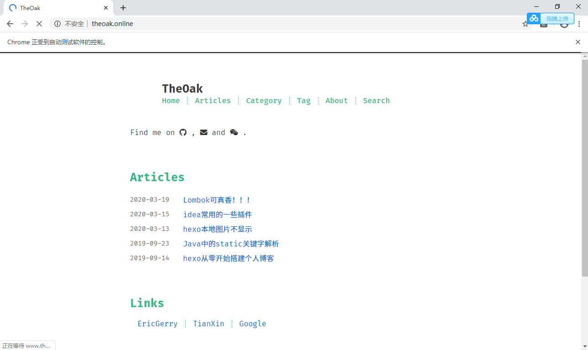
以上selenium+pycharm 自动化环境搭建完成了

今天又是美好的一天，加油呀！铁铁

