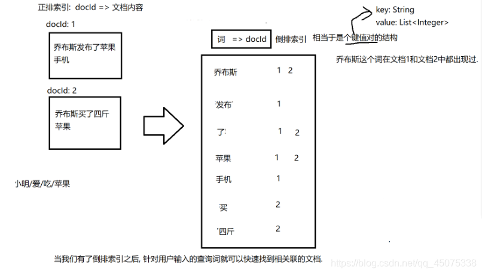

## 一、搜索引擎

> 所谓搜索引擎，就是根据用户需求与一定算法，运用特定策略从互联网检索出制定信息反馈给用户的一门检索技术。搜索引擎依托于多种技术，如网络爬虫技术、检索排序技术、网页处理技术、大数据处理技术、自然语言处理技术等，为信息检索用户提供快速、高相关性的信息服务。搜索引擎技术的核心模块一般包括爬虫、索引、检索和排序等，同时可添加其他一系列辅助模块，以为用户创造更好的网络使用环境。

## 二、搜索引擎应该有什么

- 1.有一个主页,有搜索框.在搜索框中输入的内容 称为查询词
- 2.还有搜索结果页,包含了若干条搜索结果
- 3.针对每一个搜索结果,都会包含查询词或者查询词的一部分或者和查询词有一定的关联性
- 4.每个搜索结果可能包含好几个部分:
  - a）标题
  - b）描述 通常是页面的摘要信息
  - c）子链接
  - d）展示url
  - e）图片
  - f）点击url 点击url浏览器将转到“落地页”

基于这个简单的了解, 就可以实现Java API文档的搜索引擎的部分了, 不用去网上很多网站去找数据,没那么繁琐,不用去使用爬虫去爬取,只用在网站上下载下本地文档就行,基于文档去实现的搜索引擎功能.

## 三、Java API文档

前提： 先把Java API 文档下载好,并且好准备一个txt文本.

这个Java API文档的搜索引擎大致分为以下4步.

- 预处理模块
- 索引模块
- 搜索模块
- 展示模块

### （1）预处理模块

把所有的Java API文档中html文档进行预处理：所有的文档转为一个行文本文件,每行对应一个原来的html,每一行中有三列,标题 url 去掉标签的正文。这就相当于搜索引擎整合了许多的网页资源,在后台存放.以供搜索

其中在文件中运用递归的方式（listFiles()方法获取文件中的所以子文件）去找到所以得html文档,去处理它,存到开始创建的文本文档中

```java
import java.io.*;
import java.util.ArrayList;
import java.util.Arrays;

// 遍历文档目录, 读取所有的 html 文档内容, 把结果解析成行文本文件.
// 每一行都对应一个文档. 每一行中都包含 文档标题, 文档的 URL, 文档的正文(去掉 html 标签的内容)
// Parser 是一个单独的可执行的类(带有 main 方法)
public class Parser {
    // 下载好的 Java API 文档在哪
    private static final String INPUT_PATH = "E:\\jdk1.8\\docs\\api";
    // 预处理模块输出文件存放的目录
    private static final String OUTPUT_PATH = "E:\\raw_data.txt";

    public static void main(String[] args) throws IOException {
        FileWriter resultFileWriter = new FileWriter(new File(OUTPUT_PATH));
        // 通过 main 完成整个预处理的过程
        // 1. 枚举出 INPUT_PATH 下所有的 html 文件(递归)
        ArrayList<File> fileList = new ArrayList<>();
        enumFile(INPUT_PATH, fileList);
        // 2. 针对枚举出来的html文件路径进行遍历, 依次打开每个文件, 并读取内容.
        //    把内容转换成需要的结构化的数据(DocInfo对象)
        for (File f : fileList) {
            System.out.println("converting " + f.getAbsolutePath() + " ...");
            // 最终输出的 raw_data 文件是一个行文本文件. 每一行对应一个 html 文件.
            // line 这个对象就对应到一个文件.
            String line = convertLine(f);
            // 3. 把得到的结果写入到最终的输出文件中(OUTPUT_PATH). 写成行文本的形式
            resultFileWriter.write(line);
        }
        resultFileWriter.close();
    }

    // 此处咱们的 raw_data 文件使用行文本来表示只是一种方式而已.
    // 完全也可以使用 json 或者 xml 或者其他任何你喜欢的方式来表示都行
    private static String convertLine(File f) throws IOException {
        // 1. 根据 f 转换出 标题
        String title = convertTitle(f);
        // 2. 根据 f 转换出 url
        String url = convertUrl(f);
        // 3. 根据 f 转换成正文, a) 去掉 html 标签; b) 去掉换行符
        String content = convertContent(f);
        // 4. 把这三个部分拼成一行文本
        //    \3 起到分割三个部分的效果. \3 ASCII 值为 3 的字符
        //    在一个 html 这样的文本文件中是不会存在 \3 这种不可见字符
        //    类似的, 使用 \1 \2 \4 \5....来分割效果也是一样
        return title + "\3" + url + "\3" + content + "\n";
    }

    private static String convertContent(File f) throws IOException {
        // 这个方法做两件事情:
        // 1. 把 html 中的标签去掉
        // 2. 把 \n 也去掉
        // 一个一个字符读取并判定
        FileReader fileReader = new FileReader(f);
        boolean isContent = true;
        StringBuilder output = new StringBuilder();
        while (true) {
            int ret = fileReader.read();
            if (ret == -1) {
                // 读取完毕了
                break;
            }
            char c = (char)ret;
            if (isContent) {
                // 当前这部分内容是正文
                if (c == '<') {
                    isContent = false;
                    continue;
                }
                if (c == '\n' || c == '\r') {
                    c = ' ';
                }
                output.append(c);
            } else {
                // 当前这个部分内容是标签
                // 不去写 output
                if (c == '>') {
                    isContent = true;
                }
            }
        }
        fileReader.close();
        return output.toString();
    }

    private static String convertUrl(File f) {
        // URL 线上文档对应的 URL
        // 线上文档 URL 形如:
        // https://docs.oracle.com/javase/8/docs/api/java/util/Collection.html
        // 本地目录文档路径形如:
        // D:\jdk1.8\docs\api\java/util\Collection.html
        // 线上文档的 URL 由两个部分构成.
        // part1: https://docs.oracle.com/javase/8/docs/api  固定的
        // part2: /java/util/Collection.html 和本地文件的路径密切相关.
        // 此处对于 浏览器 来说, / 或者 \ 都能识别.
        String part1 = "https://docs.oracle.com/javase/8/docs/api";
        String part2 = f.getAbsolutePath().substring(INPUT_PATH.length());
        return part1 + part2;
    }

    private static String convertTitle(File f) {
        // 把文件名(不是全路径, 去掉.html后缀)作为标题就可以了
        // 文件名: EntityResolver.html
        // 全路径: D:\jdk1.8\docs\api\org\xml\sax\EntityResolver.html
        String name = f.getName();
        return name.substring(0, name.length() - ".html".length());
    }

    // 当这个方法递归完毕后, 当前 inputPath 目录下所有子目录中的 html 的路径就都被收集到
    // fileList 这个 List 中了
    private static void enumFile(String inputPath, ArrayList<File> fileList) {
        // 递归的把 inputPath 对应的全部目录和文件都遍历一遍
        File root = new File(inputPath);
        // listFiles 相当于 Linux 上的 ls 命令.
        // 就把当前目录下所有的文件和目录都罗列出来了. 当前目录就是 root 对象所对应的目录
        File[] files = root.listFiles();
        // System.out.println(Arrays.toString(files));
        // 遍历当前这些目录和文件路径, 分别处理
        for (File f : files) {
            if (f.isDirectory()) {
                // 如果当前这个 f 是一个目录. 递归调用 enumFile
                enumFile(f.getAbsolutePath(), fileList);
            } else if (f.getAbsolutePath().endsWith(".html")) {
                // 如果当前 f 不是一个目录, 看文件后缀是不是 .html. 如果是就把这个文件的对象
                // 加入到 fileList 这个 List 中
                fileList.add(f);
            }
        }
    }
}
```

### （2）索引模块

根据预处理得到的结果来构建正排+倒排索引,

正排索引和倒排索引是撒？为什么要用呢？

> 当前搜索引擎后台获取了很多很多的网页数据,每一个网页数据都是一个html,称为文档/Document,想要知道查询词在哪些文档出现过,许多人想那不是暴力搜索就OK了？
但是文档数目太多,依次遍历的话效率就非常的低,所以就出现了倒排索引（一种特殊的数据结构）

也就是根据正排索引去构建倒排索引来看个图就行了


这个图片中可以看到把文档中的内容先有一个唯一ID标识文档,然后把文档内容进行分词然后统计在哪一个文档中出现了,并记录下来,这就是倒排索引.有了这个倒排索引,找到搜索结果也就更加方便了

构建的过程大概是这么实现的,肯定得先**构建正排索引**:
我们为正排索引建一个DocInfo类存放每个文档的具体信息,直接读取之前存放所有信息的文档,给DocInfo对象数组中存放好所有的信息,
然后**构建倒排索引**：
定义一个内部类去存放文档分词后的出现权重,对标题和正文统计,然后对每一个文档进行分词统计,放到一个hashmap中。具体思路就是这样

```java
import common.DocInfo;
import org.ansj.domain.Term;
import org.ansj.splitWord.analysis.ToAnalysis;

import java.io.*;
import java.util.ArrayList;
import java.util.HashMap;
import java.util.List;

public class Index {
    // word 这个词在 docId 文档中对应的权重是多少
    static public class Weight {
        public String word;
        public int docId;
        // weight 生成公式: 10 * 标题中出现的次数 + 正文中出现的次数
        public int weight;
    }

    // 索引类需要包含两方面的内容. 正排索引, 倒排索引
    // 正排索引是 docId => DocInfo 直接把 docId 作为数组下标就行了
    private ArrayList<DocInfo> forwardIndex = new ArrayList<>();
    // 倒排索引 词 => 一组 docId
    // 不光能得到每个词在哪些文档中出现过, 还想知道这个词在该文档中的权重是多少.
    private HashMap<String, ArrayList<Weight>> invertedIndex = new HashMap<>();

    // Index 类需要提供的方法
    // 查正排
    public DocInfo getDocInfo(int docId) {
        return forwardIndex.get(docId);
    }

    // 查倒排
    public ArrayList<Weight> getInverted(String term) {
        return invertedIndex.get(term);
    }

    // 构建索引, 把 raw_data.txt 文件内容读取出来, 加载到内存上面的数据结构中
    // raw_data.txt 是一个行文本文件. 每一行都有三个部分. 每个部分之间使用 \3 分割
    // 索引模块中最复杂的部分
    public void build(String inputPath) throws IOException {
        class Timer {
            public long readFileTime;
            public long buildForwardTime;
            public long buildInvertedTime;
            public long logTime;
        }
        Timer timer = new Timer();

        long startTime = System.currentTimeMillis();
        System.out.println("build start!");

        // 1. 打开文件, 并且按行读取文件内容
        BufferedReader bufferedReader = new BufferedReader(new FileReader(new File(inputPath)));
        // 2. 读取到的每一行.
        // 加时间是有技巧的. 不应该在比较大的循环中加入过多的打印信息. 打印信息会很多, 看起来很不方便.
        // 打印函数本身也是有时间消耗的.
        while (true) {

            long t1 = System.currentTimeMillis();

            String line = bufferedReader.readLine();
            if (line == null) {
                break;
            }

            long t2 = System.currentTimeMillis();

            // 3. 构造正排的过程: 按照 \3 来切分, 切分结果构造成一个 DocInfo 对象, 并加入到正排索引中
            DocInfo docInfo = buildForward(line);

            long t3 = System.currentTimeMillis();

            // 4. 构造倒排的过程: 把 DocInfo 对象里面的内容进一步处理, 构造出倒排
            buildInverted(docInfo);

            long t4 = System.currentTimeMillis();

            // System.out.println("Build " + docInfo.getTitle() + " done!");

            long t5 = System.currentTimeMillis();

            timer.readFileTime += (t2 - t1);
            timer.buildForwardTime += (t3 - t2);
            timer.buildInvertedTime += (t4 - t3);
            timer.logTime += (t5 - t4);
        }
        bufferedReader.close();

        long finishTime = System.currentTimeMillis();
        System.out.println("build finish! time: " + (finishTime - startTime) + " ms");
        System.out.println("readFileTime: " + timer.readFileTime
                + " buildForwardTime: " + timer.buildForwardTime
                + " buildInvertedTime: " + timer.buildInvertedTime
                + " logTime: " + timer.logTime);
    }

    private void buildInverted(DocInfo docInfo) {
        class WordCnt {
            public int titleCount;
            public int contentCount;

            public WordCnt(int titleCount, int contentCount) {
                this.titleCount = titleCount;
                this.contentCount = contentCount;
            }
        }
        HashMap<String, WordCnt> wordCntHashMap = new HashMap<>();
        // 前 4 个操作都是为了给后面的计算权重做铺垫
        // 针对 DocInfo 中的 title 和 content 进行分词, 再根据分词结果构建出 Weight 对象, 更新倒排索引
        // 1. 先针对标题分词
        List<Term> titleTerms = ToAnalysis.parse(docInfo.getTitle()).getTerms();
        // 2. 遍历分词结果, 统计标题中的每个词出现的次数
        for (Term term : titleTerms) {
            // 此处 word 已经是被转成小写了
            String word = term.getName();
            WordCnt wordCnt = wordCntHashMap.get(word);
            if (wordCnt == null) {
                // 当前这个词在哈希表中不存在
                wordCntHashMap.put(word, new WordCnt(1, 0));
            } else {
                // 当前这个词已经在哈希表中存在, 直接修改 titleCount 即可
                wordCnt.titleCount++;
            }
        }
        // 3. 再针对正文分词
        List<Term> contentTerms = ToAnalysis.parse(docInfo.getContent()).getTerms();
        // 4. 遍历分词结果, 统计正文中的每个词出现的次数
        for (Term term : contentTerms) {
            String word = term.getName();
            WordCnt wordCnt = wordCntHashMap.get(word);
            if (wordCnt == null) {
                // 当前这个词在哈希表中不存在
                wordCntHashMap.put(word, new WordCnt(0, 1));
            } else {
                wordCnt.contentCount++;
            }
        }
        // 5. 遍历 HashMap, 依次构建 Weight 对象并更新倒排索引的映射关系
        for (HashMap.Entry<String, WordCnt> entry : wordCntHashMap.entrySet()) {
            Weight weight = new Weight();
            weight.word = entry.getKey();
            weight.docId = docInfo.getDocId();
            // weight = 标题中出现次数 * 10 + 正文中出现次数
            weight.weight = entry.getValue().titleCount * 10 + entry.getValue().contentCount;
            // weight 加入到倒排索引中. 倒排索引是一个 HashMap, value 就是 Weight 构成的 ArrayList
            // 先根据这个词, 找到 HashMap 中对应的这个 ArrayList, 称为 "倒排拉链"
            ArrayList<Weight> invertedList = invertedIndex.get(entry.getKey());
            if (invertedList == null) {
                // 当前这个键值对不存在, 就新加入一个键值对就可以了
                invertedList = new ArrayList<>();
                invertedIndex.put(entry.getKey(), invertedList);
            }
            // 到了这一步, invertedIndex 已经是一个合法的 ArrayList 了, 就可以把 weight 直接加入即可
            invertedList.add(weight);
        }
    }

    private DocInfo buildForward(String line) {
        // 把这一行按照 \3 切分
        // 分出来的三个部分就是一个文档的 标题, URL, 正文
        String[] tokens = line.split("\3");
        if (tokens.length != 3) {
            // 发现文件格式有问题~~
            // 当前场景下咱们有 1w 多个文件. 如果某个文件出现格式问题,
            // 不应该让某个问题影响到整体的索引构建
            // 此处我们的处理方式仅仅就是打印了日志.
            System.out.println("文件格式存在问题: " + line);
            return null;
        }
        // 把新的 docInfo 插入到 数组末尾.
        // 如果数组是 0 个元素, 新的元素所处在的下标就是 0
        DocInfo docInfo = new DocInfo();
        // id 就是正排索引数组下标
        docInfo.setDocId(forwardIndex.size());
        docInfo.setTitle(tokens[0]);
        docInfo.setUrl(tokens[1]);
        docInfo.setContent(tokens[2]);
        forwardIndex.add(docInfo);
        return docInfo;
    }
}
```

### （3）搜索模块

搜索模块：输入的是查询词,输出结果是若干条搜索结果（每个搜索结果中包含标题,描述,URL）

- 1.分词:针对输入的查询词进行分词.
- 2.触发:遍历分词结果,去索引中找到所有和这个分词结果相关的记录(- -大堆docld)
- 3.排序:针对相关性高低，进行降序排序
- 4.包装结果:把刚才的这些docld所对应的DocInfo信息查找到,组装成一一个响应数据

在其中运用到了Comparator创建比较强,决定对象中的顺序,将权重最大的排在首位,有这俩种实现方法

> Comparable:让需要被比较的类实现这个接口，重写compareTo方法
> Comparator:创建一个比较器类,实现这个接口，实现的这个接口内部重写compare方法.

```java
import common.DocInfo;
import index.Index;
import org.ansj.domain.Term;
import org.ansj.splitWord.analysis.ToAnalysis;

import java.io.IOException;
import java.util.ArrayList;
import java.util.Comparator;
import java.util.List;

class WeightComparator implements Comparator<Index.Weight> {
    @Override

    //升序 o1 - o2  降序 o2 - o1
    public int compare(Index.Weight o1, Index.Weight o2) {
        // 如果 o1 < o2 返回一个 < 0
        // 如果 o1 > o2 返回一个 > 0
        // 如果 o1 == o2 返回 0
        return o2.weight - o1.weight;
    }
}

/**
 * 通过这个类来完成核心的搜索过程
 */
public class Searcher {
    private Index index = new Index();

    public Searcher() throws IOException {
        index.build("E:\\raw_data.txt");
    }

    public List<Result> search(String query) {
        // 1. [分词] 针对查询词进行分词
        List<Term> terms = ToAnalysis.parse(query).getTerms();
        // 2. [触发] 针对查询词的分词结果依次查找倒排索引, 得到一大堆相关的 docId
        // 这个 ArrayList 中就保存 每个分词结果 得到的倒排拉链的整体结果
        ArrayList<Index.Weight> allTokenResult = new ArrayList<>();
        for (Term term : terms) {
            // 此处得到的 word 就已经是全小写的内容了. 索引中的内容也是小写的
            String word = term.getName();
            List<Index.Weight> invertedList = index.getInverted(word);
            if (invertedList == null) {
                // 用户输入的这部分词很生僻, 在所有文档中都不存在
                continue;
            }
            allTokenResult.addAll(invertedList);
        }
        // 3. [排序] 按照权重进行降序排序
        //    匿名内部类
        allTokenResult.sort(new WeightComparator());
        // 4. [包装结果] 根据刚才查找到的 docId 在正排中查找 DocInfo, 包装成 Result 对象
        ArrayList<Result> results = new ArrayList<>();
        for (Index.Weight weight : allTokenResult) {
            // 根据 weight 中包含的 docId 找到对应的 DocInfo 对象
            DocInfo docInfo = index.getDocInfo(weight.docId);
            Result result = new Result();
            result.setTitle(docInfo.getTitle());
            result.setShowUrl(docInfo.getUrl());
            result.setClickUrl(docInfo.getUrl());
            // GenDesc 做的事情是从正文中摘取一段摘要信息. 根据当前的这个词, 找到这个词在正文中的位置
            // 再把这个位置周围的文本都获取到. 得到了一个片段
            result.setDesc(GenDesc(docInfo.getContent(), weight.word));
            results.add(result);
        }
        return results;
    }

    // 这个方法根据当前的词, 提取正文中的一部分内容作为描述.
    // 以下的实现逻辑还是咱们拍脑门出来的.
    private String GenDesc(String content, String word) {
        // 查找 word 在 content 中出现的位置.
        // word 里内容已经是全小写了. content 里头还是大小写都有.
        int firstPos = content.toLowerCase().indexOf(word);
        if (firstPos == -1) {
            // 极端情况下, 某个词只在标题中出现, 而没在正文中出现, 在正文中肯定找不到了
            // 这种情况非常少见, 咱们暂时不考虑
            return "";
        }
        // 从 firstPos 开始往前找 60 个字符, 作为描述开始. 如果前面不足 60 个, 就从正文头部开始;
        int descBeg = firstPos < 60 ? 0 : firstPos - 60;
        // 从描述开始往后找 160 个字符作为整个描述内容. 如果后面不足 160 个, 把剩下的都算上.
        if (descBeg + 160 > content.length()) {
            return content.substring(descBeg);
        }
        return content.substring(descBeg, descBeg + 160) + "...";
    }
}
```

### （4）展示模式

先写一个后端的servlet接口,去响应前端的请求,
servlet中主要还是获取到分词后的倒排索引的数组排序后转换为Json字符串的格式响应给前端.

```java

import com.google.gson.Gson;
import com.google.gson.GsonBuilder;
import searcher.Result;
import searcher.Searcher;

import javax.servlet.ServletException;
import javax.servlet.annotation.WebServlet;
import javax.servlet.http.HttpServlet;
import javax.servlet.http.HttpServletRequest;
import javax.servlet.http.HttpServletResponse;
import java.io.IOException;
import java.util.List;

@WebServlet("/search")
public class DocSearcherServlet extends HttpServlet {
    private Searcher searcher = new Searcher();
    private Gson gson = new GsonBuilder().create();

    public DocSearcherServlet() throws IOException {
    }

    @Override
    protected void doGet(HttpServletRequest req, HttpServletResponse resp) throws ServletException, IOException {
        resp.setContentType("application/json; charset=utf-8");
        String query = req.getParameter("query");
        if (query == null || query.equals("")) {
            resp.setStatus(404);
            resp.getWriter().write("query 参数非法");
            return;
        }
        List<Result> results = searcher.search(query);
        String respString = gson.toJson(results);
        resp.getWriter().write(respString);
    }
}


前端代码

```java
<html xmlns:v-on="http://www.w3.org/1999/xhtml" xmlns:v-bind="http://www.w3.org/1999/xhtml">
<head>
    <!-- Bootstrap 文档: https://v3.bootcss.com/css/ -->
    <!-- Vue 文档: https://cn.vuejs.org/v2/guide/ -->
    <!-- Required meta tags -->
    <meta charset="utf-8">
    <meta name="viewport" content="width=device-width, initial-scale=1, shrink-to-fit=no">

    <!-- Bootstrap CSS -->
    <link rel="stylesheet" href="https://cdn.jsdelivr.net/npm/bootstrap@3.3.7/dist/css/bootstrap.min.css" integrity="sha384-BVYiiSIFeK1dGmJRAkycuHAHRg32OmUcww7on3RYdg4Va+PmSTsz/K68vbdEjh4u" crossorigin="anonymous">

    <title>Java API 搜索</title>
    <style>
        #app {
            margin-left:50px;
            margin-right:50px;
        }
        div button {
            width:100%;
        }
        .row {
            padding-top: 10px;
        }
        .col-md-5,.col-md-1 {
            padding-left:2;
            padding-right:2;
        }
        .title {
            font-size: 22px;
        }
        .desc {
            font-size: 18px;
        }
        .url {
            font-size: 18px;
            color: green;
        }
    </style>
</head>
<body>
<div id="app">
    <div class="row">我是 logo</div>
    <div class="row">
        <div class="col-md-5">
            <input type="text" class="form-control" placeholder="请输入关键字" v-model="query">
        </div>
        <div class="col-md-1">
            <button class="btn btn-success" v-on:click="search()">搜索</button>
        </div>
    </div>
    <div class="row" v-for="result in results">
        <!--用来存放结果-->
        <div class="title"><a v-bind:href="result.clickUrl">{{result.title}}</a></div>
        <div class="desc">{{result.desc}}</div>
        <div class="url">{{result.showUrl}}</div>
    </div>
</div>
</body>
<script src="https://apps.bdimg.com/libs/jquery/2.1.4/jquery.min.js"></script>
<script src="https://cdn.jsdelivr.net/npm/bootstrap@3.3.7/dist/js/bootstrap.min.js" integrity="sha384-Tc5IQib027qvyjSMfHjOMaLkfuWVxZxUPnCJA7l2mCWNIpG9mGCD8wGNIcPD7Txa" crossorigin="anonymous"></script>
<script src="https://cdn.jsdelivr.net/npm/vue"></script>
<script>
    var vm = new Vue({
        el: "#app",
        data: {
            query: "",
            results: [ ]
        },
        methods: {
            search() {
                $.ajax({
                    url:"/java_doc_searcher/search?query=" + this.query,
                    type: "get",
                    context: this,
                    success: function(respData, status) {
                        this.results = respData;
                    }
                })
            },
        }
    })
</script>
</html>
```

到这里基于搜索引擎的Java API文档就编写完了
