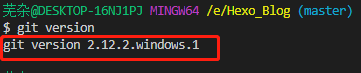
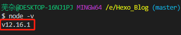
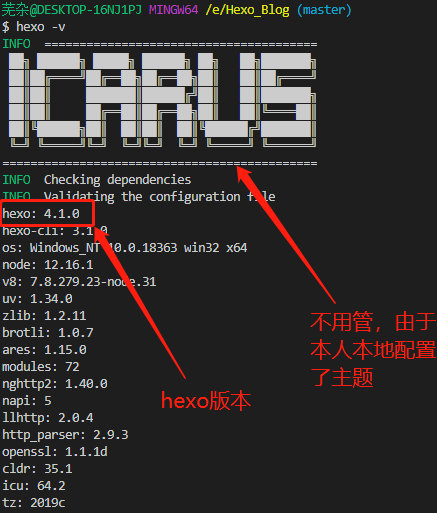
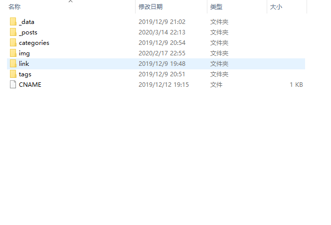
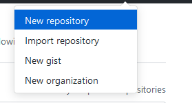
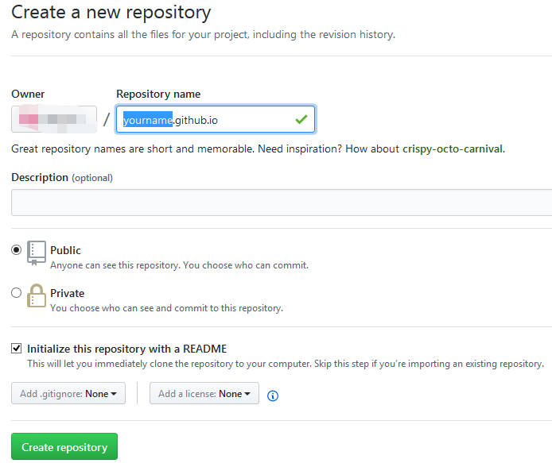
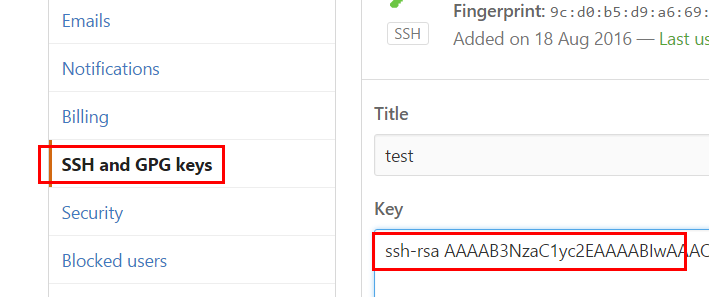
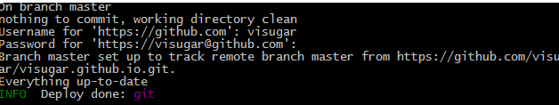
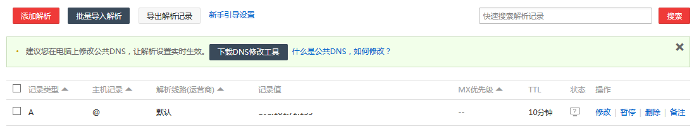
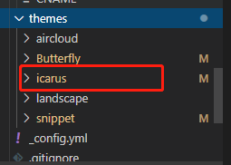

### 1.什么是 Hexo

Hexo 是一个快速、简洁且高效的博客框架。Hexo 使用 Markdown（或其他渲染引擎）解析文章，在几秒内，即可利用靓丽的主题生成静态网页
具体参考[Hexo官方文档](https://hexo.io/zh-cn/docs/index.html)
[Hexo博客](http://www.theoak.online)
<!--more-->
### 2.安装Git

我一直不太喜欢在cmd中操作各种命令，所以挑了这个比较好使的Git, 我的是windows环境，所以下载windows版本并安装就可以了。

* [下载地址](https://git-scm.com/downloads)
* 安装步骤：双击下载好的exe文件，一路next就好啦
* 安装好后，打开gitbash，查看版本：
命令：git version (写这篇博客的时候最新版本：2.12.2)


### 3. 安装NodeJs

Hexo是基于nodeJS环境的静态博客，里面的npm工具很有用啊，所以还是老老实实把这玩意儿装了吧

* [下载地址](https://nodejs.org/en/)(说明：LTS为长期支持版，Current为当前最新版)
* 安装步骤：反正下载好msi文件后，双击打开安装，也是一路next，不过在Custom Setup这一步记得选 Add to PATH ,这样你就不用自己去配置电脑上环境变量了，装完在按 win + r 快捷键调出运行，然后输入cmd确定，在cmd中输入path可以看到你的node是否配置在里面（环境变量），没有的话你就自由发挥吧。
* 查看版本：


### 4. 安装hexo

后面的东西都是在gitbash中用npm工具安装就好了。

* 先创建一个文件夹（用来存放所有blog的东西），然后cd到该文件夹下。
* 安装hexo命令：npm i -g hexo
* 安装完成后，查看版本：

* 初始化命令：hexo init ，初始化完成之后打开所在的文件夹可以看到以下文件：

* 解释一下：
  * node_modules：是依赖包
  * public：存放的是生成的页面
  * scaffolds：命令生成文章等的模板
  * source：用命令创建的各种文章
  * themes：主题
  * _config.yml：整个博客的配置
  * db.json：source解析所得到的
  * package.json：项目所需模块项目的配置信息

* 做好这些前置工作之后接下来的就是各种配置了

### 5.桥接到github

* 没账号的创建账号，有账号的看下面。
* 创建一个repo，名称为yourname.github.io, 其中yourname是你的github名称，按照这个规则创建才有用哦，如下：


* 回到gitbash中，配置github账户信息（YourName和YourEail都替换成你自己的github用户名和注册github使用的邮箱）：
  
  ```git
  git config --global user.name "YourName"
  git config --global user.email "YourEmail"
  ```

* 创建SSH
  在gitbash中输入：ssh-keygen -t rsa -C "youremail@example.com，生成ssh。然后按下图的方式找到id_rsa.pub文件的内容。

  ```ssh
  cd ~/. ssh #检查本机已存在的ssh密钥
  ```

  如果提示：No such file or directory 说明你是第一次使用git。

  ```ssh
  ssh-keygen -t rsa -C "邮件地址"
  ```

  然后连续3次回车，最终会生成一个文件在用户目录下，打开用户目录，找到.ssh\id_rsa.pub文件，记事本打开并复制里面的内容，打开你的github主页，进入个人设置 -> SSH and GPG keys -> New SSH key：
  
  将刚复制的内容粘贴到key那里，title随便填，保存。

### 6.做到这里就快接近成功了

* 用编辑器打开你的blog项目，修改_config.yml文件的一些配置(冒号之后都是有一个半角空格的)：

  ```hexo
  deploy:
    type: git
    repo: git@github.com:YourName/YourName.github.io.git
    branch: master
    ```

* 回到gitbash中，进入你的blog目录，分别执行以下命令：

  ```hexo
  hexo clean
  hexo generate #生成静态页面至public目录
  hexo server #开启预览访问端口（默认端口4000，'ctrl + c'关闭server
  ```

注：hexo 3.0把服务器独立成个别模块，需要单独安装：npm i hexo-server。

打开浏览器输入：<http://localhost:4000>

接着你就可以遇见天使的微笑了

### 7. 上传到github

* 先安装一波：npm install hexo-deployer-git --save（这样才能将你写好的文章部署到github服务器上并让别人浏览到）
* 执行命令(建议每次都按照如下步骤部署)：
  
  ```hexo
  hexo clean #(或hexo cl)
  hexo generate #(或hexo g)
  hexo deploy #(或hexo d)部署到GitHub
  ```

  **注意**deploy的过程中要输入你的username及passward。如下：
  

* 在浏览器中输入<http://yourgithubname.github.io>就可以看到你的个人博客啦，是不是很兴奋！
* 感觉gitbash中东西太多的时候输入clear命令清空。

### 8. 绑定个人域名

* 不想绑定的自行忽略
* 第一步购买域名：随便在哪个网站买一个就好了，小花是在* 阿里云购买的visugar.com, DNS也是顺道在那买的。
* 第二步添加CNAME：在项目的source文件夹下新建一个名为CNAME的文件，在里面添加你购买的域名，比如我添加的是visugar.com，只能添加一个哦。
* 到DNS中添加一条记录(域名解析)：
  
* 其中ip地址为你的github的地址，可在cmd中ping一下就能看到(ping yourname.github.io)
* 接着再次部署一下，用你购买的域名打开，就可以看到你的博客啦

### 9. 修改及配置主题

* hexo初始化之后默认的主题是landscape , 然后你可以去[hexo主题](https://hexo.io/themes/)里面找到你想要的主题。在github中搜索你要的主题名称，里面都会有该主题的如何使用的介绍，按着来就好了，反正就是改改改！我选的是icarus,看起来挺不错，至少是我喜欢的类型,简洁。

* 在根目录下./_config.yml里theme：里配置上你需要的主题就可以了
* 跟该主题相关的配置在themes/icarus/_config.yml里面,然后根据你的需要在这就行了，可以修改前端的一些信息。
* 重新部署一下就OK啦！

### 10.常用hexo命令

* 总结一些常用的hexo命令相信可以用到后期你还需了解些markdown语法

```hexo
hexo new "postName" #新建文章
hexo new page "pageName" #新建页面
hexo generate #生成静态页面至public目录
hexo server #开启预览访问端口（默认端口4000，'ctrl + c'关闭server）
hexo deploy #部署到GitHub
hexo help  # 查看帮助
hexo version  #查看Hexo的版本
```

缩写

```hexo
hexo n == hexo new
hexo g == hexo generate
hexo s == hexo server
hexo d == hexo deploy
```

组合

```hexo
hexo s -g #生成并本地预览
hexo d -g #生成并上传
```

同时如需也可以使用&&组合hexo命令使用

如需了解跟多关注[github](https://github.com/EricGerry)
