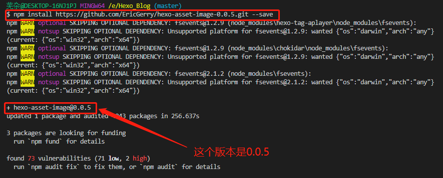
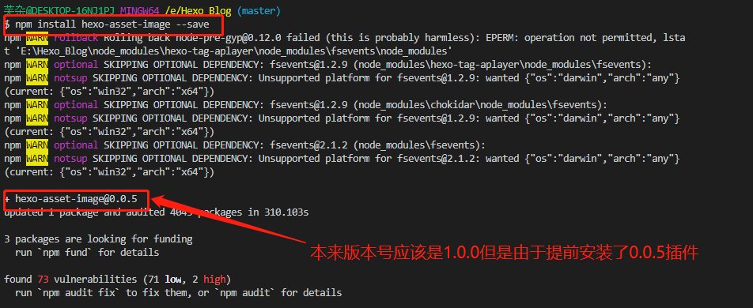
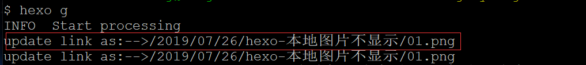
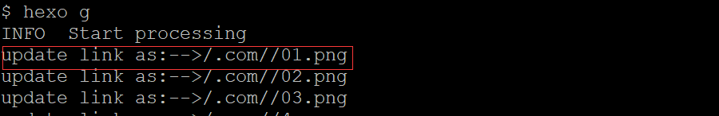

### 1、修改文件_config.yml 里的post_asset_folder:这个选项设置为true

* 修改之后，再使用hexo n "hexo 本地图片不显示"时，目录的样子是

```目录
hexo本地图片不显示
    ├── 01.jpg
    ├── 02.jpg
    └── 03.jpg
    ...
    hexo本地图片不显示.md
```

<!--more-->

### 2、安装[hexo-asset-image](https://github.com/EricGerry/hexo-asset-image-0.0.5.git),可以上传本地图片的插件

```npm
npm install https://github.com/EricGerry/hexo-asset-image-0.0.5.git --save
```


注意 不要使用npm install hexo-asset-image --save这个命令安装,版本号不对


* 0.0.5版本

* 1.0.0版本


### 3、在md使用如下形式引用图片

```markdown

```

**注意** 这里要使用"/"

### 4、使用以下命令发布博客

```hexo
hexo clean
hexo g
hexo d
```

**注意** 重命名md文件之后记得重命名文件夹，当md文件的名称与文件夹名称不同时，映射关系以md文件名称为主。会导致src图片路径找不到

**总结**：

* 检查_config.yml 文件的post_asset_folder:选项是否为true
* 检查创建文件之后的目录结构
* 检查hexo-asset-image插件的版本
* 检查路径引用图片的路径使用/
* 检查md文件的文件名称和图片存放文件夹名称是否相同