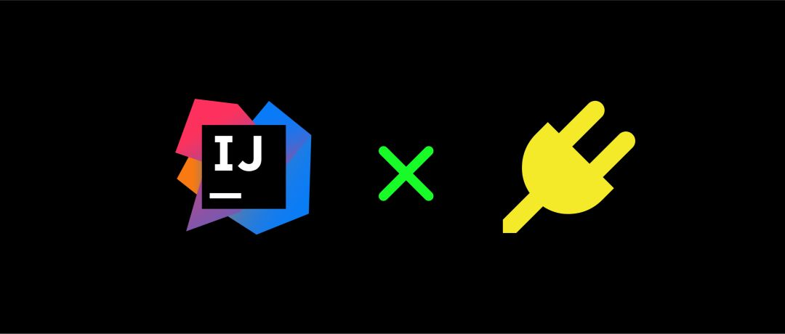
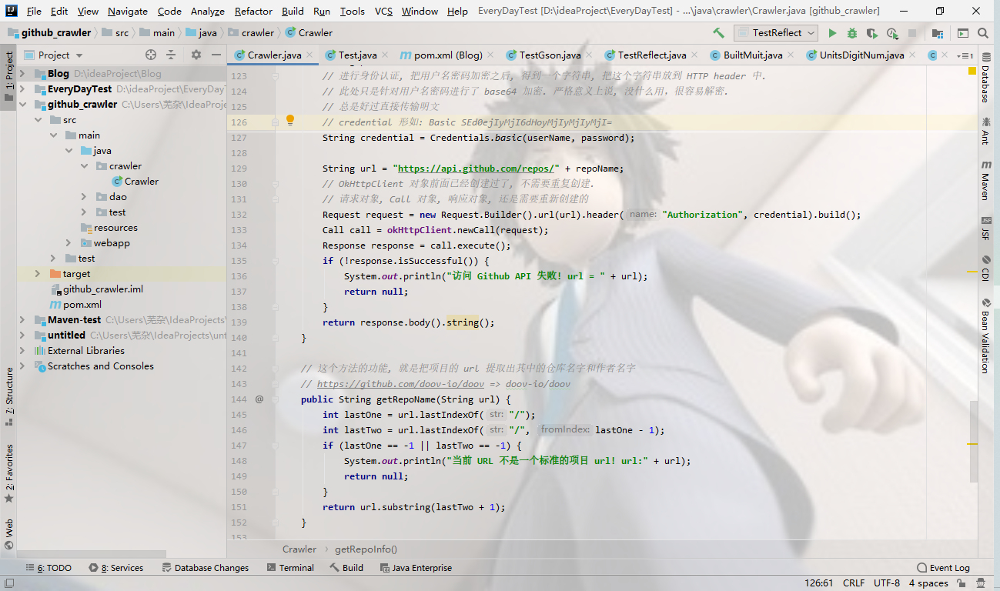
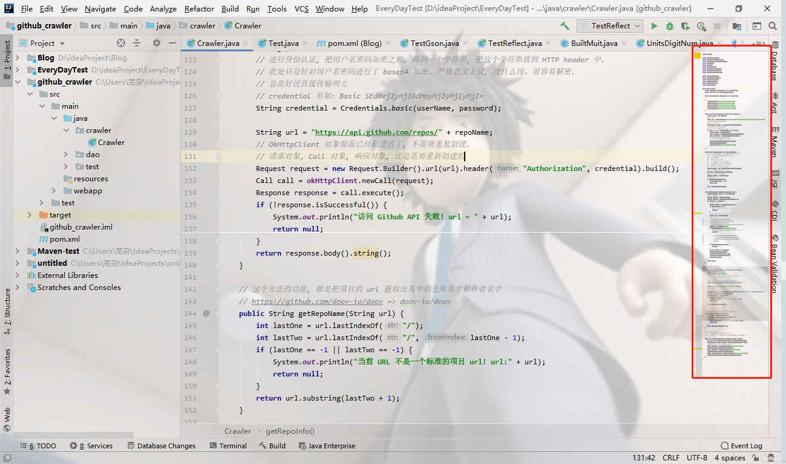
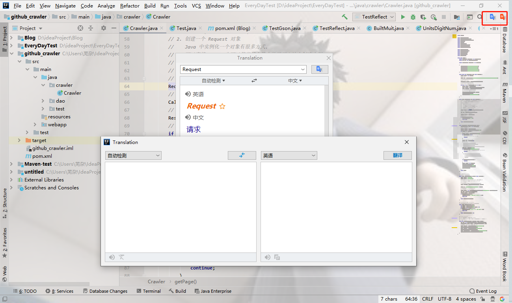
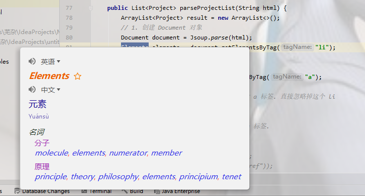
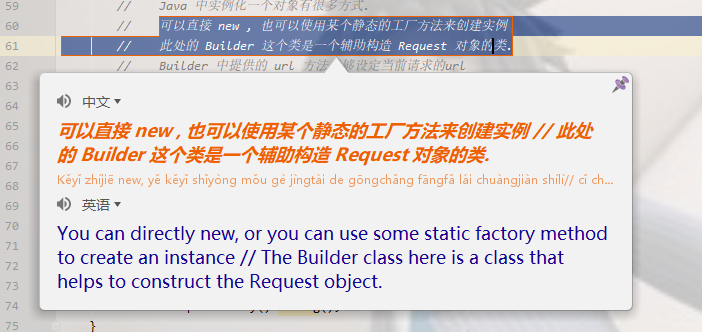
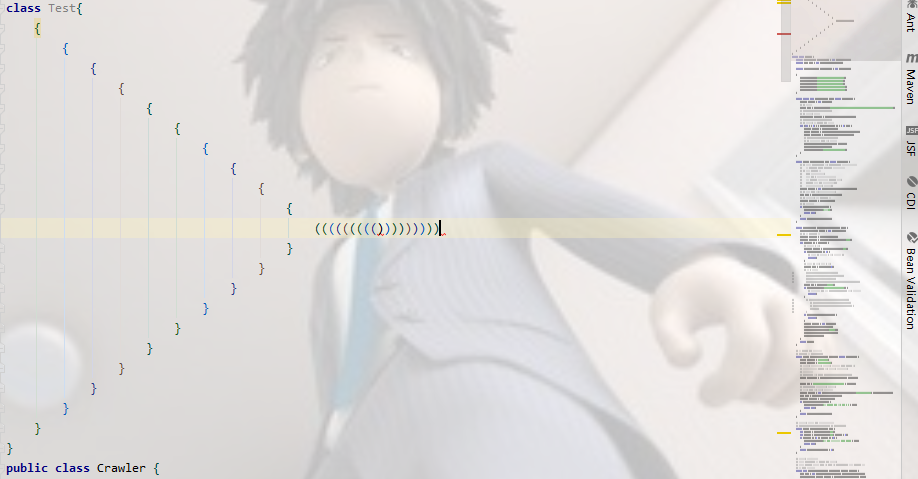
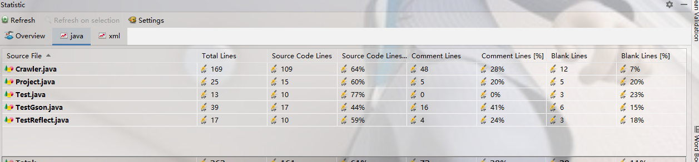
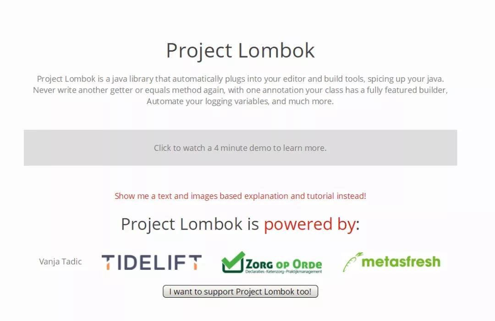

今天给分享一下中常用的几款能提升幸福感IDEA插件

---

### 1.Background Image Plus
<!--more-->
默认IDEA的背景一般都比较单调，要么白乎乎，要么褐乎乎，而Background Image Plus这个插件可以为IDEA设置自定义图片作为背景，而且还可以设置透明度，从此写代码乐趣十足

**背景图设置效果如下：**

---

### 2.CodeGlance

CodeGlance是一款非常好用的代码地图插件，可以在代码编辑区的右侧生成一个竖向可拖动的代码缩略区，可以快速定位代码的同时，并且提供放大镜功能

**右侧代码缩略图效果:**

---

### 3.Translation

代码中经常遇到不认识的英文单词或者句子，很懵怎么办？

Translation是一款非常好用的翻译插件，可以随时随地翻译单词、甚至一段话，从此不再需要额外打开浏览器搜索翻译网站了！

**翻译逐个单词：**

**翻译一段话：**

---

### 4.Rainbow Brackets

在代码非常复杂时，各种俄罗斯套娃式的括号简直让人心碎，Rainbow Brackets则是一款可以对成对括号进行着色的插件，顾名思义“彩虹色的括号”，从此复杂代码一眼即可看穿！

装完插件，括号都被染上了彩虹的颜色

---

### 5.Statistic

天天闷头写代码！

* 你知道你项目到底有多少行代码吗？
* 你知道项目代码里有多少是实际代码？
* 有多少是空行？
* 有多少是注释吗？
* . . .

Statistic则是一款可以做项目全局代码统计信息的小插件

---

### 6.Lombok

#### Lombok到底是什么

先看一下它的官网

**大致意思是：** Lombok是一个很牛批的插件（本质是个Java库），项目里一旦引入了Lombok之后，你项目中所有诸如：对象的构造函数、 equals()方法，属性的 get()/set()方法等等，这些没有技术含量的代码统统都不用写了，Lombok帮你搞定一切，全部帮你自动生成。
总之很香就是啦，后面会写一篇有关于lombok的博客！
