## 1. 概念

### 1.1 排序

&emsp;排序，就是使一串记录，按照其中的某个或某些关键字的大小，递增或递减的排列起来的操作。
平时的上下文中，如果提到排序，通常指的是排升序（非降序）。
通常意义上的排序，都是指的原地排序(in place sort)。

### 1.2 稳定性（重要）

&emsp;两个相等的数据，如果经过排序后，排序算法能保证其相对位置不发生变化，则我们称该算法是具备稳定性的排序算法。

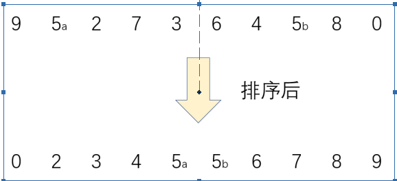

### 1.3 应用

1. 各大商城的价格从低到高等

2. 中国大学排名
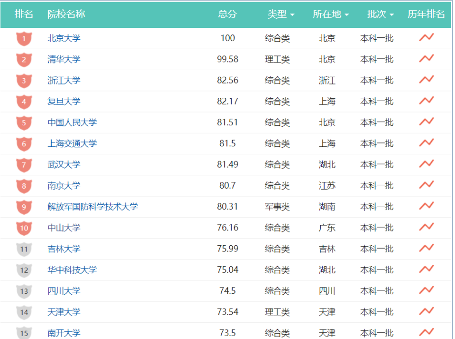

## 2.七大基于比较的排序

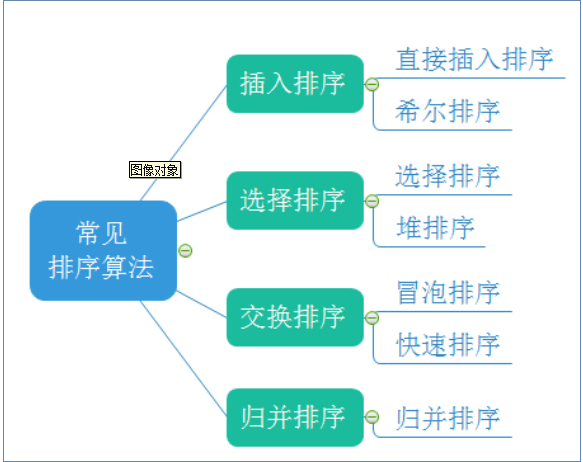

[排序舞蹈](https://www.bilibili.com/video/av17449274)

## 3. 插入排序

### 3.1 直接插入排序-原理

整个区间被分为

- 1. 有序区间
- 2. 无序区间

每次选择无序区间的第一个元素，在有序区间内选择合适的位置插入
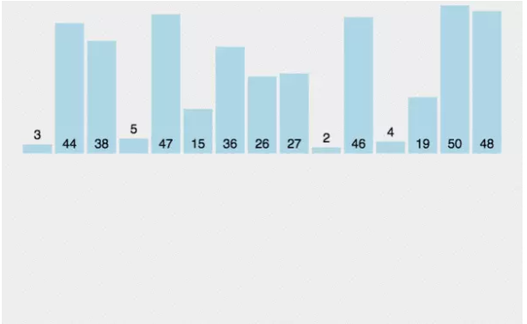

### 3.2 实现

```java
public static void insertSort(int[] array) {
    for (int i = 1; i < array.length; i++) {
        // 有序区间: [0, i)
        // 无序区间: [i, array.length)
        int v = array[i]; // 无序区间的第一个数
        int j = i - 1;
        // 不写 array[j] == v 是保证排序的稳定性
        for (; j >= 0 && array[j] > v; j--) {
            array[j + 1] = array[j];
       }
        array[j + 1] = v;
   }
}
```

### 3.3 性能分析

时间复杂度

最好|平均|最坏
:-:|:-:|:-:
O(n)|O(n^2)|O(n^2)|
数据有序| |数据逆序

空间复杂度|O(1)
:-:|:-:

### 3.4 折半插入排序

在有序区间选择数据应该插入的位置时，因为区间的有序性，可以利用折半查找的思想。

```java
public static void bsInsertSort(int[] array) {
    for (int i = 1; i < array.length; i++) {
        int v = array[i];
        int left = 0;
        int right = i;
        // [left, right)
        // 需要考虑稳定性
        while (left < right) {
            int m = (left + right) / 2;
            if (v >= array[m]) {
                left = m + 1;
           } else {
                right = m;
           }
       }
        // 搬移
        for (int j = i; j > left; j--) {
            array[j] = array[j - 1];
       }
         array[left] = v;
   }
}
```

## 4. 希尔排序

### 4.1 原理

&emsp;希尔排序法又称缩小增量法。希尔排序法的基本思想是：先选定一个整数，把待排序文件中所有记录分成个组，所有
距离为的记录分在同一组内，并对每一组内的记录进行排序。然后，取，重复上述分组和排序的工作。当到达=1时，
所有记录在统一组内排好序。

- 1. 希尔排序是对直接插入排序的优化。
- 2. 当gap > 1时都是预排序，目的是让数组更接近于有序。当gap == 1时，数组已经接近有序的了，这样就会很快。这样整体而言，可以达到优化的效果。我们实现后可以进行性能测试的对比。
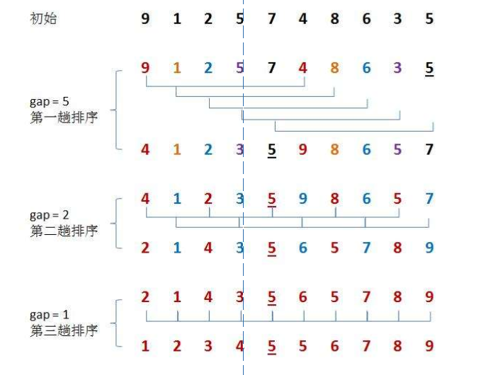
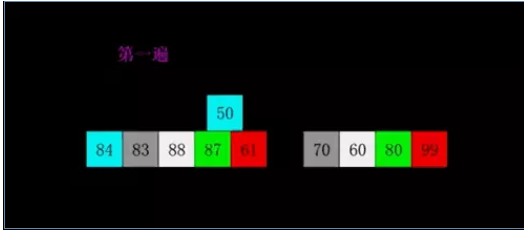

### 4.2 实现

```java
public static void shellSort(int[] array) {
    int gap = array.length;
    while (gap > 1) {
        insertSortGap(array, gap);
        gap = (gap / 3) + 1; // OR gap = gap / 2;
   }
    insertSortGap(array, 1);
}
private static void insertSortGap(int[] array, int gap) {
    for (int i = 1; i < array.length; i++) {
        int v = array[i];
        int j = i - gap;
        for (; j >= 0 && array[j] > v; j -= gap) {
            array[j + gap] = array[j];
       }
        array[j + gap] = v;
   }
}
```

### 4.3 性能分析

时间复杂度

最好|平均|最坏
:-:|:-:|:-:
O(n)|O(n^1.3)|O(n^2)
数据有序| |比较难构造

空间复杂度|O(1)
:-:|:-:

稳定性：不稳定

## 5. 选择排序

### 5.1 直接选择排序-原理

每一次从无序区间选出最大（或最小）的一个元素，存放在无序区间的最后（或最前），直到全部待排序的数据元素排完 。
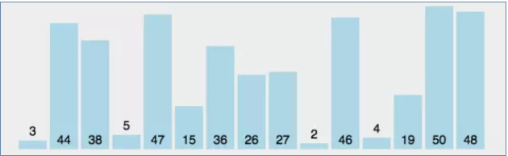

### 5.2 实现

```java
public static void selectSort(int[] array) {
    for (int i = 0; i < array.length - 1; i++) {
        // 无序区间: [0, array.length - i)
        // 有序区间: [array.length - i, array.length)
        int max = 0;
        for (int j = 1; j < array.length - i; j++) {
            if (array[j] > array[max]) {
                max = j;
           }
       }
        int t = array[max];
        array[max] = array[array.length - i - 1];
        array[array.length - i - 1] = t;
   }
}
```

### 5.3 性能分析

时间复杂度|空间复杂度
:-:|:-:|
O(n^2)|O(1)
数据不敏感|数据不敏感

稳定性：不稳定

```java
int[] a = { 9, 2, 5a, 7, 4, 3, 6, 5b };
// 交换中该情况无法识别，保证 5a 还在 5b 前边
```

### 5.4 双向选择排序

每一次从无序区间选出最小 + 最大的元素，存放在无序区间的最前和最后，直到全部待排序的数据元素排完。

```java
public static void selectSortOP(int[] array) {
    int low = 0;
    int high = array.length - 1;
    // [low, high] 表示整个无序区间
    // 无序区间内只有一个数也可以停止排序了
    while (low <= high) {
        int min = low;
        int max = low;
        for (int i = low + 1; i <= max; i++) {
            if (array[i] < array[min]) {
                min = i;
           }
            if (array[i] > array[max]) {
                max = i;
           }
       }
        swap(array, min, low);
        // 见下面例子讲解
        if (max == low) {
            max = min;
       }
        swap(array, max, high);
   }
}
private void swap(int[] array, int i, int j) {
    int t = array[i];
    array[i] = array[j];
    array[j] = t; }
array = { 9, 5, 2, 7, 3, 6, 8 }; // 交换之前
// low = 0; high = 6
// max = 0; min = 2
array = { 2, 5, 9, 7, 3, 6, 8 }; // 将最小的交换到无序区间的最开始后
// max = 0，但实际上最大的数已经不在 0 位置，而是被交换到 min 即 2 位置了
// 所以需要让 max = min 即 max = 2
array = { 2, 5, 8, 7, 3, 6, 9 }; // 将最大的交换到无序区间的最结尾后
```

## 6. 堆排序

### 6.1 原理

基本原理也是选择排序，只是不在使用遍历的方式查找无序区间的最大的数，而是通过堆来选择无序区间的最大的
数。
注意： 排升序要建大堆；排降序要建小堆。

[堆排序](https://www.cs.usfca.edu/~galles/visualization/HeapSort.html)

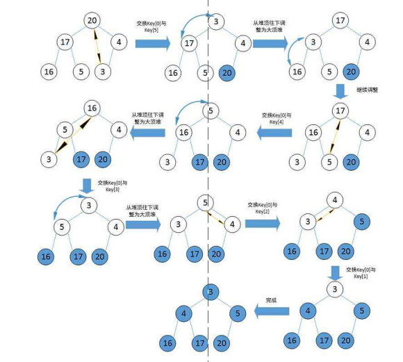

### 6.2 实现

```java
public static void heapSort(int[] array) {
    createHeap(array);
    for (int i = 0; i < array.length - 1; i++) {
        // 交换前
        // 无序区间: [0, array.length - i)
        // 有序区间: [array.length - i, array.length)
        swap(array, 0, array.length - 1);
        // 交换后
        // 无序区间: [0, array.length - i - 1)
        // 有序区间: [array.length - i - 1, array.length)
        // 无序区间长度: array.length - i - 1
        shiftDown(array, array.length - i - 1, 0);
   }
}
private void swap(int[] array, int i, int j) {
    int t = array[i];
    array[i] = array[j];
    array[j] = t; }
private void createHeap(int[] array) {
    for (int i = (array.length - 1) / 2; i >= 0; i--) {
        shiftDown(array, array.length, i);
   }
}
public static void shiftDown(int[] array, int size, int index) {
    int left = 2 * index + 1;
    while (left < size) {
        int max = left;
   int right = 2 * index + 2;
        if (right < size) {
            if (array[right] > array[left]) {
                max = right;
           }
       }
        if (array[index] >= array[max]) {
            break;
       }
        int t = array[index];
        array[index] = array[max];
        array[max] = t;
        index = max;
        left = 2 * index + 1;
   }
}
```

### 6.3 性能分析

时间复杂度|空间复杂度
:-:|:-:
O(n * log(n))|O(1)
数据不敏感|数据不敏感

稳定性：不稳定

## 7. 冒泡排序

### 7.1 原理

在无序区间，通过相邻数的比较，将最大的数冒泡到无序区间的最后，持续这个过程，直到数组整体有序
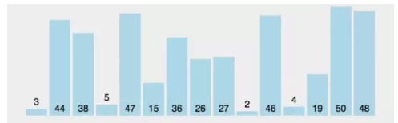

### 7.2 实现

```java
public static void bubbleSort(int[] array) {
    for (int i = 0; i < array.length - 1; i++) {
 boolean isSorted = true;
        for (int j = 0; j < array.length - i - 1; j++) {
 // 相等不交换，保证稳定性
            if (array[j] > array[j + 1]) {
                swap(array, j, j + 1);
                isSorted = false;
                }
            }
    if (isSorted) {
        break;
        }
    }
}
```

### 7.3 性能分析

时间复杂度
最好|平均|最坏
:-:|:-:|:-:
O(n)|O(n^2)|O(n^2)
数据有序| |数据逆序

空间复杂度|O(1)
:-:|:-:

稳定性：稳定

## 8. 快速排序

### 8.1 原理

- 1. 从待排序区间选择一个数，作为基准值(pivot)；
- 2. Partition: 遍历整个待排序区间，将比基准值小的（可以包含相等的）放到基准值的左边，将比基准值大的（可以包含相等的）放到基准值的右边；
- 3. 采用分治思想，对左右两个小区间按照同样的方式处理，直到小区间的长度 == 1，代表已经有序，或者小区间的长度 == 0，代表没有数据。
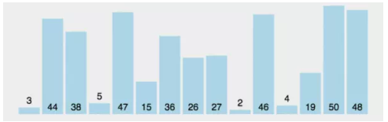

**实现:**

```java
public static void quickSort(int[] array) {
 quickSortInternal(array, 0, array.length - 1);
}
// [left, right] 为待排序区间
private static void quickSortInternal(int[] array, int left, int right) {
 if (left == right) {
 return;
 }
 if (left > right) {
 return;
 }
 // 最简单的选择基准值的方式，选择 array[left] 作为基准值
 // pivotIndex 代表基准值最终停留的下标
 int pivotIndex = partition(array, left, right);
 // [left, pivotIndex - 1] 都是小于等于基准值的
 // [pivotIndex + 1, right] 都是大于等于基准值的
 quickSortInternal(array, left, pivotIndex - 1);
 quickSortInternal(array, pivotIndex + 1, right);
}
```

### 8.2 原理-partition

#### Hoare 法

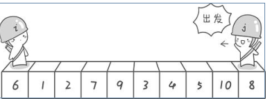
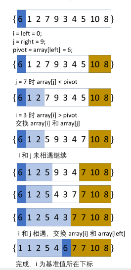

#### 实现

```java
private static int partition(int[] array, int left, int right) {
 int i = left;
 int j = right;
 int pivot = array[left];
 while (i < j) {
 while (i < j && array[j] >= pivot) {
 j--;
 }
 while (i < j && array[i] <= pivot) {
 i++;
 }
 swap(array, i, j);
 }
 swap(array, i, left);
 return i;
}
```

### 8.3 性能分析

#### 时间复杂度

最好|平均|最坏
:-:|:-:|:-:
O(n*log(n))|O(n*log(n))|O(n^2)

#### 空间复杂度

 最好|平均|最坏
 :-:|:-:|:-:
O(log(n))|O(log(n))|O(n)

稳定性：不稳定

### 8.4 原理-基准值的选择

- 1. 选择边上（左或者右）
- 2. 随机选择
- 3. 几数取中（例如三数取中）：array[left], array[mid], array[right] 大小是中间的为基准值

### 8.5 原理-非递归分治

```java
public static void quickSort(int[] array) {
 Stack<Integer> stack = new Stack<>();
 stack.push(array.length - 1);
 stack.push(0);
 while (!stack.isEmpty()) {
 int left = stack.pop();
 int right = stack.pop();
 if (left >= right) {
 continue;
 }
 int pivotIndex = partition(array, left, right);
 stack.push(right);
 stack.push(pivotIndex + 1);
 stack.push(pivotIndex - 1);
 stack.push(left);
 }
}
```

## 9. 归并排序

### 9.1 原理

&emsp;归并排序（MERGE-SORT）是建立在归并操作上的一种有效的排序算法,该算法是采用分治法（Divide and
Conquer）的一个非常典型的应用。将已有序的子序列合并，得到完全有序的序列；即先使每个子序列有序，再使子序列段间有序。若将两个有序表合并成一个有序表，称为二路归并。

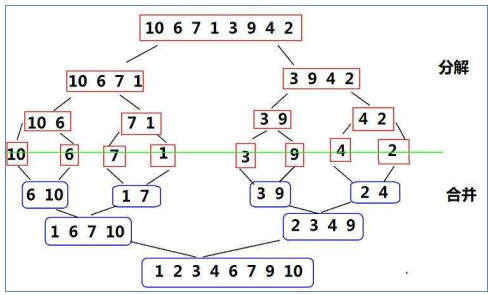
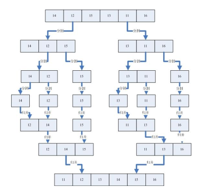

### 9.2 原理-合并两个有序数组

```java
private static void merge(int[] array, int low, int mid, int high) {
 int i = low;
 int j = mid;
 int length = high - low;
 int[] extra = new int[length];
 int k = 0;
 // 选择小的放入 extra
 while (i < mid && j < high) {
 // 加入等于，保证稳定性
 if (array[i] <= array[j]) {
 extra[k++] = array[i++];
 } else {
 extra[k++] = array[j++];
 }
 }
 // 将属于元素放入 extra
 while (i < mid) {
 extra[k++] = array[i++];
 }

 while j < right) {
 extra[k++] = array[j++];
 }
 // 从 extra 搬移回 array
 for (int t = 0; t < length; t++) {
 // 需要搬移回原位置，从 low 开始
 array[low + t] = extra[t];
 }
}
```

### 9.3 实现

```java
public static void mergeSort(int[] array) {
 mergeSortInternal(array, 0, array.length);
}
// 待排序区间为 [low, high)
private static void mergeSortInternal(int[] array, int low, int high) {
 if (low - 1 >= high) {
 return;
 }
 int mid = (low + high) / 2;
 mergeSortInternal(array, low, mid);
 mergeSortInternal(array, mid, high);
 merge(array, low, mid, high);
}
```

### 9.4 性能分析

时间复杂度|空间复杂度
:-:|:-:
O(n*log(n))|O(n)
数据不敏感|数据不敏感

稳定性：稳定

### 9.5 优化总结

在排序过程中重复利用两个数组，减少元素的复制过程

### 9.6 非递归版本

```java
public static void mergeSort(int[] array) {
 for (int i = 1; i < array.length; i = i * 2) {
 for (int j = 0; j < array.length; j = j + 2 * i) {
 int low = j;
 int mid = j + i;
 if (mid >= array.length) {
 continue;
 }
  int high = mid + i;
 if (high > array.length) {
 high = array.length;
 }

 merge(array, low, mid, high);
 }
 }
}
```

### 9.7 海量数据的排序问题

外部排序：排序过程需要在磁盘等外部存储进行的排序
前提：内存只有 1G，需要排序的数据有 100G
因为内存中因为无法把所有数据全部放下，所以需要外部排序，而归并排序是最常用的外部排序

- 1. 先把文件切分成 200 份，每个 512 M
- 2. 分别对 512 M 排序，因为内存已经可以放的下，所以任意排序方式都可以
- 3. 进行 200 路归并，同时对 200 份有序文件做归并过程，最终结果就有序了

## 10.  排序总结

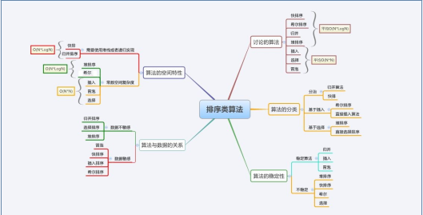

排序方法|最好|平均|最坏|空间复杂度|稳定性
:-:|:-:|:-:|:-:|:-:|:-:|:-:
冒泡排序|O(n)|O(n^2)|O(n^2)|O(1)|稳定
插入排序|O(n)|O(n^2)|O(n^2)|O(1)|稳定
选择排序|O(n^2)|O(n^2)|O(n^2)|O(1)|不稳定
希尔排序|O(n)|O(n^1.3)|O(n^2)|O(1)|不稳定
堆排序|O(n*log(n))|O(n*log(n))|O(n*log(n))|O(1)|不稳定
快速排序|O(n*log(n))|O(n*log(n))|O(n^2)|O(log(n))~O(n)|不稳定
归并排序|O(n*log(n))|O(n*log(n))|O(n*log(n))|O(n)|稳定

## 11. 其他非基于比较的排序

### [计数排序](https://zhuanlan.zhihu.com/p/26595385?group_id=842495057868226560)

### [基数排序](https://www.runoob.com/w3cnote/radix-sort.html)

### [桶排序](https://www.cnblogs.com/bqwzx/p/11029264.html)
