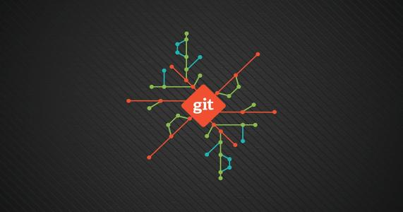
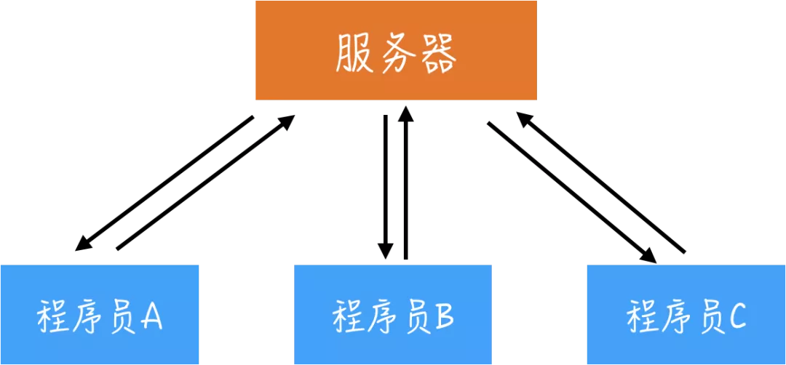
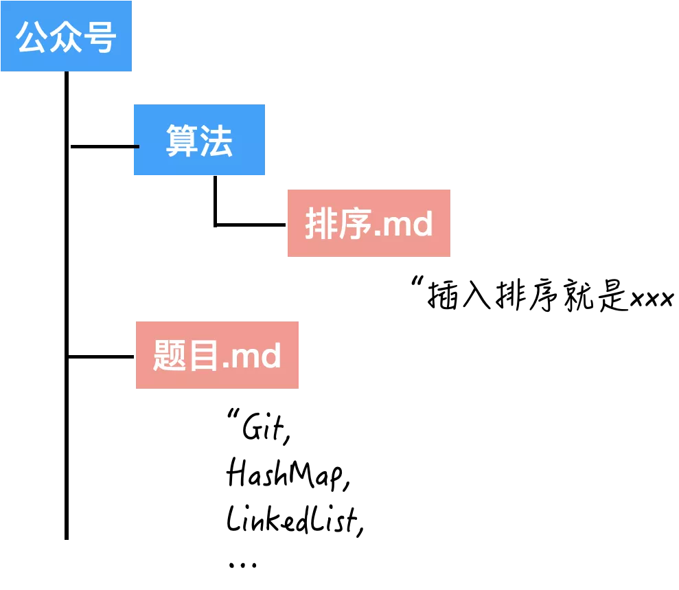
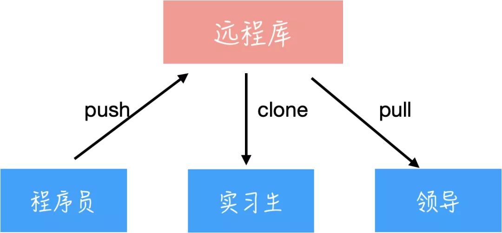
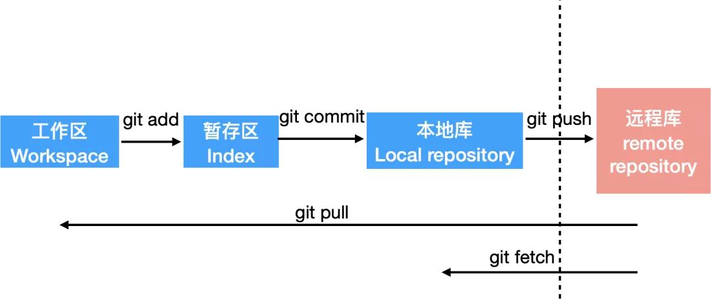
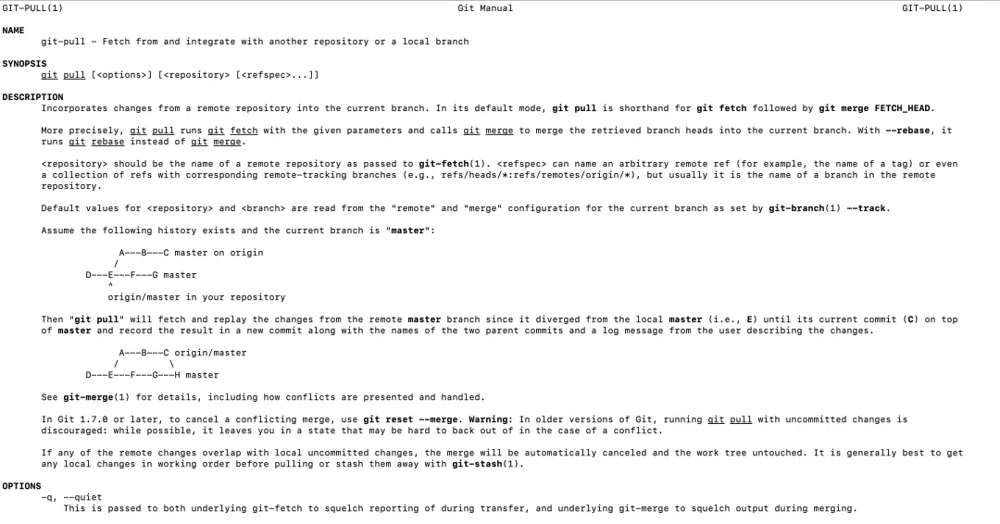

## Git的诞生原由

> Talk is cheap. Show me the code.

这句话就出自 Linux 和 Git 的作者**Linus Torvalds**。

原本 Linux 内核的版本控制系统是用的 BitKeeper，然而 2005 年，BitMover 公司不再让 Linux 开发团队免费使用了。

Linus 一听，不给用了？我自己写！

于是，大佬十天之内完成了 Git 的第一个版本。

所以 Git 是一个免费的、开源的版本控制系统。

## 版本控制系统

版本控制其实每个人都用过，比如修改过的简历。

没错，这就是本地版本控制系统。

很明显，好处是简单，但是只能一个人在这改，无法和他人完成合作。那么以下两种主流的版本控制系统应运而生。

### 1. 集中化版本控制系统Centralized Version Control Systems (CVCS)

比如：CVS, Subversion, Perforce, etc.

这种版本控制系统有一个单一的集中管理的服务器，保存所有文件的最新版本，大家可以通过连接到这台服务器上来获取或者提交文件。


这种模式相对本地版本控制系统是有所改进的，但是缺点也很明显，如果服务器宕机，那么轻则耽误工作、重则数据丢失。于是分布式版本控制系统应运而生。

### 2. 分布式版本控制系统Distributed Version Control Systems (DVCS)

比如：Git, Mercurial, Bazaar, etc.

分布式的版本控制系统会把代码仓库完整地镜像下来，这样任何一个服务器发生故障，都可以用其他的仓库来修复。

更进一步，这种模式可以更方便的和不同公司的人进行同一项目的开发，因为两个远程代码仓库可以交互，这在之前的集中式系统中是无法做到的。

#### 那么什么叫“把代码仓库完整地镜像下来”呢

CVCS 每个版本存放的是当前版本与前一个版本的差异，因此也被称作基于差异的版本控制 (delta-based)；

Git 存储的是所有文件的一个快照 (snapshot)，如果有的文件没有修改，那就只保留一个 reference 指向之前存储的文件。

不是很好理解？那接着看吧～

## Git 的数据模型

### 1. 什么是快照 (snapshot) 呢

首先我们来学两个 Git 中的术语：

- blob, 就是单个的文件；
- tree, 就是一个文件夹。
快照则是被追踪的最顶层的树。

文件夹的这么一个结构：


那么一个快照就是追踪的“公众号”这颗树。

### 2. 本地库的数据模型

Git 记录了每个快照的 parent，也就是当前这个文件夹的上一个版本。

那么快照的迭代更新的过程就可以表示为一个有向无环图：


每个快照其实都对应了一次 commit，用代码来表示一下：

```git
class commit {
  array<commit> parents
  String author
  String message
  Tree snapshot
}
```

这就是 Git 的数据模型。

blob, tree, snapshot 其实都一样，它们在 Git 中都是对象，都可以被引用或者被搜索，会基于它们的 SHA-1 hash 进行寻址。

- git cat-file -t: 查看每个 SHA-1 的类型;
- git cat-file -p: 查看每个
- 对象的内容和简单的数据结构。
但是通过这个哈希值来搜索也太不方便了，毕竟这是一串 40 位的十六进制字符，就是第二部分 git log 里输出的那个编码。

因此，Git 还给了一个引用 reference。

比如，我们常见的 HEAD 就是一个特殊的引用。

本地库就是由 对象 和 引用 构成的，或者叫 Repositories.

在硬盘上，Git 只存储 对象 和 引用，所有的 Git 命令都对应提交一个快照。

那有哪些常用命令呢？

## 常用命令

本章分三大部分，介绍日常常用命令：

- 本地操作
- 和远程库的交互
- 团队协作 - 分支

### 本地操作

在学习常用命令之前，你首先需要知道的 Git 的「三个分区」和对应的文件的「三种状态」：


**工作区：** 就是你本地实际写代码的地方，无论你是用 vim 直接改也好，还是在 IDE 里写，都无所谓。
对应的文件状态是：modified，已修改，但还没保存到数据库中。

**暂存区：** 就是临时存放的地方。
对应的文件状态是：staged，Git 已经对该文件做了标记，下次提交知道要包含它。

**本地库：** 存放本地历史版本信息。
对应的文件状态是：committed，文件已经安全的保存在本地数据库中。

#### 1. $ git add

工作区改完了代码，就用 git add 提交到暂存区。

这里如果文件改动的比较多，但又不是每个都需要提交，我会设置 git ignore file，就表示这些文件不要提交，比如在 build project 的时候会自动生成的那些文件等等。

#### 2. $ git commit -m "comment"

从暂存区提交到本地库，就需要用 commit。

一般后面都会跟个 -m 加句 comment，简单说下改动的内容或者原因，我们公司大家默认也会把 Jira链接附上，这样就知道这个改动对应哪个任务。

那如果想再改，再重新 git add 即可，但是 commit 这句需要改成

```git
$git commit --amend
```

这样就还是一条 git log 信息。

#### 3. $ git log

git log 可以查看到提交过的信息，从近到远显示每次 commit 的 comment 还有作者、日期等信息，比如大概长这个样子：

```git
commit 5abcd17dggs9s0a7a91nfsagd8ay76875afs7d6
Author: Xiaoqi<xxx@163.com>
Date: xxx xxx xxx
改了 Test 文件
```

commit 后面的这个编号，是每次历史记录的一个索引。比如如果需要对版本进行前进或者后退的时候，就需要用到它。

这样打印的 log 太多，更简洁的打印方式是：

```git
$git log --oneline
```

就一行打印出来了。

或者：

```git
$git reflog
```

更常用一些。

#### 4. $ git reset

那我们刚刚说过，如果需要前进或退回到某个版本，就用

```git
$git reset --hard <编号>
```

这样就直接跳到了这个编号对应的那个版本。

那么这个 hard 是什么意思呢？

这里有 3 个参数：hard, soft, mixed，我们一一来说一下。

回到我们最重要的这张图上来：


刚刚说的前进或后退到某一版本，是对本地库进行的操作。

那有个问题：
本地库的代码跳到那个版本之后，工作区和暂存区的代码就和本地库的不同步了呀！

那这些参数就是用来控制这些是否同步的。

**$ git reset --hard xxx.**

三个区都同步，都跳到这个 xxx 的版本上。

**$ git reset --soft xxx.**

前面两个区不同步，就只有本地库跳到这个版本。

**$ git reset --mixed xxx.**

暂存区同步，工作区不动。

所以呢，用的多的就是 hard.

### 远程交互


和远程库的交互主要是推、拉，也就是写入和读取。

#### 5. $ git push

写完了代码，要提交到公司的代码库里，这个过程要用 git push.

当然了，这么用会被打的。。毕竟还要 cr 呢。

#### 6. $ git clone

学习首先要 clone 整个项目到本地来，然后才能增删改查。

当然了实际工作中也没人这么用。。因为每家公司都会有自己包装的工具。不过如果是做 Github 上的开源项目，就用得上了。

#### 7. $ git pull

提交了新的代码之后，领导要审查呀，所以用 git pull 把最新的代码拉取下来瞅瞅。

实际上呢，

```git
git pull = fetch + merge
```

#### 8. $ git fetch

git fetch 这个操作是将远程库的数据下载到本地库，但是工作区中的文件没有更新。



而要谈 get merge，还需要先讲下分支。

merge 是 git pull 默认的选项，合并其实还有另外一种方法：rebase，中文叫做变基。

#### 9. $ git rebase

rebase 的作用更多的是来整合分叉的历史，可以将某个分支上的所有修改都移到另一分支上，就像是变了基底。

### 分支与合并

首先来看几个关于分支的基本操作：

#### 10. 查看分支

$ git branch

类似于ls，能够列出当前所有分支。

git branch -v 能够显示更多信息。

#### 11. 创建分支

$ git branch < branchName >

#### 12. 切换分支

$ git checkout < branchName >

有了分支之后必然会有合并：

#### 13. 合并分支

$ git merge < branchName >

而合并时就可能会有冲突，什么时候会有冲突呢？

在同一个文件的同一个位置修改时。

因为 Git 会努力的把你们改动不同的地方合并在一起，但如果实在是在同一个地方改的，那它也没办法了，只能留给程序员去手动处理了。

## 学习资源

### git help

其实我个人使用最多的是git help

真心方便又好用啊！

比如 git help pull:



先介绍了有哪些参数，然后 description 详细解释了它的工作原理，下面还有图解，有木有太香！！

不过这种方式更像是 cheatsheet，当你已经知道了这个命令、只是忘了它的用法的时候去查。

### Pro Git

Pro Git 这本书不仅讲了 Git 的基础用法、高级用法，以及最后还深入讲解了 Git 的原理，非常细致全面。

书的电子版也能在网站上直接下载。

[英文版](https://git-scm.com/book/en/v2)

[中文版](https://git-scm.com/book/zh/v2)

### 玩游戏

Practice makes perfect!

推荐一个宝藏资源：玩游戏来练 Git

[项目](https://github.com/pcottle/learnGitBranching)

[网址](https://learngitbranching.js.org/)
